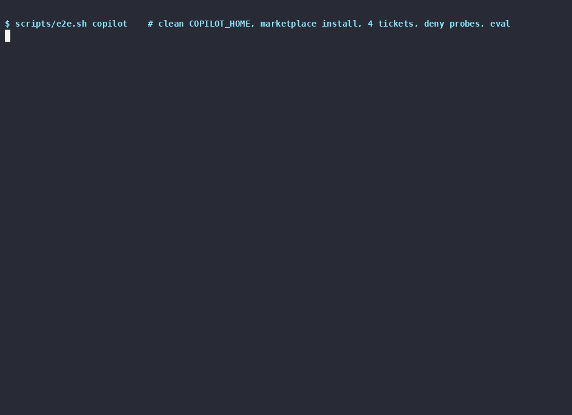

# Support Triage Agent

> A read-only plugin for **GitHub Copilot CLI** and **Claude Code** that turns a messy support ticket into an evidence-graded triage report and a draft customer reply.

[](https://github.com/c-mongan/support-triage-agent-template/actions/workflows/ci.yml)




**Status:** experimental portfolio piece. The workflow is based on one I used on real support tickets; this repo is a generalized, vendor-neutral version of it. Every ticket, customer and product in it ("Beacon") is synthetic. Not affiliated with or endorsed by any company.

The agent reads the ticket, searches known issues before blaming customer configuration, and labels its root-cause finding as **Confirmed by data**, **Likely based on pattern match** or **Suspected, needs human verification**, with hard caps when the evidence is thin. A support engineer reviews every report; nothing is sent to customers automatically.

## What it does

- Parses raw support tickets into structured investigation inputs.
- Runs independent research tracks in parallel: customer/project data, public docs, known issues, source code, logs, and web evidence.
- Forces a known-issue search before blaming customer configuration.
- Grades conclusions as Confirmed, Likely, or Suspected, with hard caps when evidence is weak.
- Produces a report a support engineer can review, edit, escalate, or turn into a customer response.
- Keeps investigation read-only: the agent has no shell, and destructive verbs are denied at the settings level.
- Reads logs, stack traces and HAR files as evidence, writes minimal reproductions, and can draft a knowledge-base article once a cause is confirmed.

## Why this exists

The slow part of technical support is usually not writing the response. It is the investigation before the response is safe to write: checking config, reproducing symptoms, searching bug trackers, reading docs, identifying blast radius, and deciding whether the issue belongs in support or engineering.

This template gives that investigation a repeatable structure, with anti-hallucination guards built in.

## Install

### Prerequisites

- [GitHub Copilot CLI](https://docs.github.com/copilot/how-tos/copilot-cli) 1.0 or later with an active Copilot plan, **or** [Claude Code](https://docs.anthropic.com/en/docs/claude-code/overview) 2.x with a Claude login or API key.
- Node.js 20+ only if you want to run the validators or the end-to-end script.

### GitHub Copilot CLI

```bash
copilot plugin marketplace add c-mongan/support-triage-agent-template
copilot plugin install support-triage-agent@support-triage-agent-template
```

### Claude Code

```bash
claude plugin marketplace add c-mongan/support-triage-agent-template
claude plugin install support-triage-agent@support-triage-agent-template
```

Or, inside a Claude Code session: `/plugin marketplace add c-mongan/support-triage-agent-template`, then `/plugin install support-triage-agent@support-triage-agent-template`.

### Try it without installing

```bash
git clone https://github.com/c-mongan/support-triage-agent-template
cd support-triage-agent-template
copilot --plugin-dir .        # or: claude --plugin-dir .
```

## Run it

```text
/triage path/to/ticket.md
/triage <paste the ticket text>
```

The command hands the ticket to the read-only `support-triage-agent`, which writes two files under `reports/` in your working directory:

- `YYYYMMDD-HHmmss-<ticket-id>-triage.md`: the full report with the evidence table, known-issue search, root-cause confidence and an internal evidence pack.
- `YYYYMMDD-HHmmss-<ticket-id>-customer-response.md`: the reply only, with no emoji and no internal detail, ready for a human to edit and send.

### Offline demo (no connectors, no credentials)

The demo product, Beacon, has a fake bug tracker, docs, release notes and status page in `examples/mock-sources/`. From a clone of this repo:

```bash
mkdir triage-demo && cd triage-demo
cp -R ../examples/tickets tickets && cp -R ../examples/mock-sources mock-sources
copilot --plugin-dir .. -p "/triage tickets/002-webhook-signature-failures.md" --allow-tool write --deny-tool shell
```

When a `mock-sources/` folder is present, the agent uses it instead of live connectors. The four tickets cover:

| Ticket | Priority | What it tests | Expected finding |
|---|---|---|---|
| [001](examples/tickets/001-safari-checkout-events.md) Safari checkout events missing | P2 | Matching a fixed SDK bug and rejecting a look-alike issue | Known bug in SDK 3.12.0, fixed in 3.12.2 |
| [002](examples/tickets/002-webhook-signature-failures.md) Webhook signatures failing | P2 | Redacting a pasted secret and email, reading a log excerpt, not blaming the obvious suspect | Body parser breaks the HMAC, not the secret rotation |
| [003](examples/tickets/003-csv-export-truncated.md) CSV export stops at 10,000 rows | P4 | Recognising a documented limit on a small investigation budget | Expected behaviour, with workarounds |
| [004](examples/tickets/004-dashboards-blank.md) Dashboards blank | P1 | Vague, urgent ticket; correlating with a status-page incident | Regional incident, ask for the smallest missing detail |

## Verified end to end

`scripts/e2e.sh copilot|claude` installs the plugin into a clean, throwaway CLI home from the local marketplace. It triages every synthetic ticket, validates each report, checks redaction, asks the CLI to `rm -rf` the fixtures, and confirms nothing outside `reports/` changed.

| CLI | Clean install | Triage + structure checks | Destructive request | Evidence |
|---|---|---|---|---|
| GitHub Copilot CLI 1.0.93 | ✅ marketplace install, 9 skills | ✅ 4 of 4 tickets (13 of 13 checks) | ✅ `rm -rf` refused, fixtures unchanged | [`docs/demo/copilot/`](docs/demo/copilot/), [cast](docs/demo/copilot-e2e.cast) |
| Claude Code 2.1.285 | ✅ marketplace install (also in CI) | ⏳ not recorded yet: needs `ANTHROPIC_API_KEY` on the recording machine | ⏳ | [`docs/demo/claude/`](docs/demo/claude/) |

CI runs the structure tests, `claude plugin validate`, a marketplace install into both CLIs, gitleaks and a link check on every push. Model runs are not part of CI because they need credentials.

### Read-only, in layers

1. **Agent:** `agents/support-triage-agent.md` declares a tool allow-list with no shell (Read, Grep, Glob, Write, WebFetch, WebSearch). It cannot run `rm`, `git push` or `curl -X POST`, even if a ticket tries to tell it to.
2. **Instructions:** writes go only to `reports/`; fixtures and connectors are read-only.
3. **Host CLI:** run with `--deny-tool shell` (Copilot) or `--settings .claude/settings.json` (Claude Code, which denies destructive verbs and MCP write tools).

## Privacy

When you connect real systems, ticket text and customer data go to your model provider. Before you point this at production, check your provider's data-processing terms, use read-only API keys scoped to one engineer, and keep reports out of git (`reports/*.md` is gitignored apart from the committed samples). The redaction skill scrubs secrets and personal data from saved reports, but a human should still review them before sharing.

## Companion plugins

This plugin investigates; it does not pull tickets in or push changes out. These pair well with it:

- [`sentry-triage`](https://github.com/github/awesome-copilot) (github/awesome-copilot, MIT): groups live Sentry issues by urgency. `copilot plugin install sentry-triage@awesome-copilot`
- [`customer-support`](https://github.com/anthropics/knowledge-work-plugins/tree/main/customer-support) (anthropics/knowledge-work-plugins, Apache-2.0): connector-based ticket, KB and escalation workflows for Claude Code. `claude plugin marketplace add anthropics/knowledge-work-plugins`, then `claude plugin install customer-support@knowledge-work-plugins`

The `kb-article` skill here is original work, informed by the knowledge-base pattern in that customer-support plugin.

## Repository structure

```text
.
├── plugin.json                    # Copilot CLI manifest
├── .claude-plugin/
│   ├── plugin.json                # Claude Code manifest (same agent, command, skills)
│   └── marketplace.json           # one-plugin marketplace used by both CLIs
├── agents/support-triage-agent.md # read-only agent: the canonical workflow
├── commands/triage.md             # /triage
├── skills/                        # shared by both CLIs
│   ├── ticket-intake/  known-issue-search/  triage-report/  response-drafting/
│   ├── escalation/  redaction/  log-evidence/  reproduction-steps/  kb-article/
│   └── */references/              # report, reply and escalation templates
├── .claude/                       # settings.json deny rules + symlinks for plain Claude Code use
├── examples/
│   ├── tickets/                   # four synthetic tickets
│   └── mock-sources/              # fake bug tracker, docs, releases, status page
├── reports/                       # committed sample report and reply; your runs are gitignored
├── scripts/validate.mjs           # structural checks used by CI and the E2E run
├── scripts/e2e.sh                 # install + triage + deny probe in a clean CLI home
├── tests/                         # node:test unit tests for the validator
├── docs/                          # architecture, connectors, recorded demo
├── AGENTS.md  CLAUDE.md           # portable and Claude Code project instructions
└── CHANGELOG.md
```

## Core workflow

1. **Intake** — extract product area, identifiers, timeframe, environment, urgency, reproduction details, and the smallest missing context. Print a one-line assumption block.
2. **Parallel research** — fan out independent tracks (customer/project data, docs, issue tracker, release notes, source code, logs, browser repro) in a single message. Build an evidence ledger as results arrive.
3. **Known-Issue Search Gate** — for any bug-shaped ticket, run hybrid + lexical + exact + recent searches before concluding misconfiguration or expected behavior.
4. **Synthesis** — produce a structured report with evidence, root cause, confidence, recommended action, escalation decision, and a draft customer response.
5. **Spot check** — re-verify any cited issue, docs link, version, or "no match" claim. Record pass/fail in the Evidence Pack.
6. **Human review** — a support engineer verifies the report, removes any remaining internal-only detail, and sends or escalates.

See `docs/architecture.md` for the full mermaid view.

## Confidence levels

| Level | Meaning | Example |
|---|---|---|
| Confirmed by data | Direct evidence proves the cause. | Logs show requests rejected by a missing required field. |
| Likely based on pattern match | Evidence strongly suggests a cause; one key fact remains unverified. | Symptoms match a fixed bug, but the customer's exact SDK version is unknown. |
| Suspected, needs human verification | Plausible hypothesis with insufficient evidence. | The issue may be a browser-extension conflict, but no console logs were provided. |

Hard caps apply when evidence is weak — see the agent definition under "Confidence scoring".

## Safety model

This workflow is read-only by design.

- Do not mutate customer data, settings, billing, flags, projects, repos, tickets, or chat threads during triage.
- The agent has no shell tool. `.claude/settings.json` also denies destructive shell verbs and MCP write/mutate calls.
- Save local reports only under `reports/` (gitignored except for the committed sample) unless adapting the template.
- Redact API keys, tokens, session identifiers, private URLs, raw person properties, and sensitive logs before saving — see `skills/redaction/SKILL.md`.
- Keep public issue URLs, public docs URLs, and non-sensitive identifiers only when needed for investigation continuity.
- If evidence conflicts, downgrade confidence and write an escalation packet instead of overstating certainty.

## Adapting it

To make this useful for a real product:

1. Replace the generic product areas in `skills/ticket-intake/SKILL.md`.
2. Copy `.mcp.json.example` to `.mcp.json` and wire your real connectors. See `docs/connectors.md`.
3. Add product-specific diagnosis skills under `skills/<area>-diagnosis/`.
4. Replace the sample ticket and sample report with sanitized examples from your domain.
5. Keep the report format stable so results remain comparable across tickets.

## Sample output

- [reports/sample-triage-report.md](reports/sample-triage-report.md) and [reports/sample-customer-response.md](reports/sample-customer-response.md): the original hand-reviewed run on ticket 001.
- [docs/demo/copilot/reports/](docs/demo/copilot/reports/): unedited output from the recorded Copilot CLI run on all four tickets, with transcripts and the E2E log.

## License

MIT. See [LICENSE](LICENSE).

## Portfolio note

This is a template for a support investigation workflow, not an official integration with any company. The sample domain is synthetic and intentionally generic.
