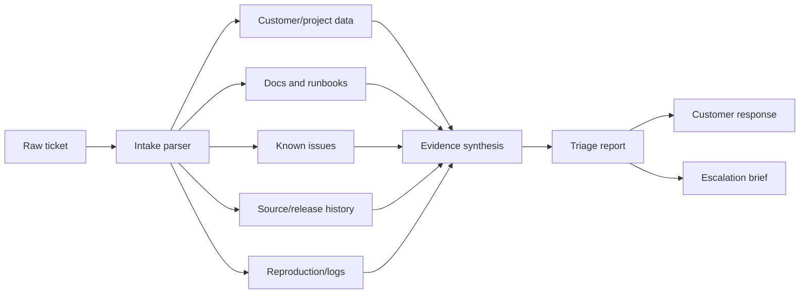

# Architecture

This template separates investigation into five small stages.

## Design Choices

- **Read-only first:** support tooling should not mutate production state while investigating.
- **Parallel research:** independent checks should run together so the human gets a head start quickly.
- **Evidence grading:** every conclusion carries a confidence level.
- **Reusable report shape:** consistent reports make it easier to compare issues, spot recurring problems, and measure quality.
- **Domain-specific skills:** the generic workflow stays small, while product-specific diagnosis lives in separate skills.

