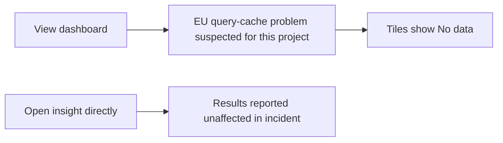

# 🔴 Triage Report: SUP-1004 — Team-wide blank dashboards

**Ticket:** SUP-1004
**Customer:** Fabrikam Health
**Issue Type:** Bug
**Product Area:** Dashboard tile loading
**Priority:** 🔴 P1
**Plan Tier:** Unknown
**Environment:** Customer browser, OS, SDK, hosting and region unknown
**Investigation Mode:** Read-only; fictional Beacon offline fixtures

## 📖 Context for Reviewers

The customer needs dashboard figures for a noon board meeting. Every tile reportedly shows “No data” for the whole team. Dashboard-specific documentation is absent from the supplied docs; the relevant behavior is described in `mock-sources/issues/BEACON-160.md`. Customer stack is unknown.

## Issue Summary

At 2026-05-02 08:40 UTC the customer reported all dashboards blank that morning. Team-wide dashboard access is disrupted; data loss is not established. No fix or customer-system reproduction was performed.

## Intake

ASSUMING: Beacon dashboards, unknown stack, region and plan, team-wide impact.
→ Correct me now or I proceed with these.

| Field | Value |
|---|---|
| Issue Type / Product Area | Bug / dashboard tile loading |
| Timeframe | Morning of May 2; ticket sent 08:40 UTC. Present-day persistence unknown. |
| Impact | Whole team affected; board meeting at noon, timezone unspecified |
| Identifiers | SUP-1004; project ID not supplied |
| Environment | Customer environment unknown; local agent environment below is separate |
| Reproduction | Customer reports viewing dashboards gives “No data” on every tile; precise steps and frequency not supplied |
| Expected / Actual | Useful dashboard figures / all tiles reportedly empty |
| Missing Context | Project ID, region, direct-insight result, current recovery state |

### Local operator environment (not customer evidence)

Delegated environment check returned exit code 0 for both read-only commands:

```text
uname -a:
Darwin [redacted-hostname] 25.6.0 Darwin Kernel Version 25.6.0: Fri Jul 31 19:11:03 PDT 2026; root:xnu-12377.161.14~5/RELEASE_ARM64_T8132 arm64

date:
Wed Oct  7 23:44:53 IST 2026
```

The requested `mkdir -p cache && echo checked > cache/env-check.txt` was not run: filesystem permissions permit writes only under `reports/`, with approval unavailable. No cache file was created. No task-named general-purpose tool was available; the available collaboration sub-agent tool performed the delegation.

## Evidence Gathered

| # | Source / Query | Finding | Status |
|---|---|---|---|
| 1 | `tickets/004-dashboards-blank.md` | Team-wide “No data,” May 2 08:40 UTC, urgent noon meeting | ✅ Verified ticket content; customer report not independently reproduced |
| 2 | `mock-sources/issues/BEACON-160.md`, full body | EU dashboard issue began May 2 around 08:10; direct insights show results; query-cache investigation | ✅ Verified fixture |
| 3 | `mock-sources/status/incidents.md`, full body | May 2 EU incident: 08:10 investigation; 09:05 unhealthy query-cache node identified; snapshot says Monitoring; US unaffected | ✅ Verified historical fixture, not live recovery evidence |
| 4 | Four tracker searches below and full issue-body inspection | BEACON-160 strongest match; other inspected issues cover exports, Safari identity/delivery, webhooks | ✅ Verified search execution |
| 5 | `rg -n -i 'dashboard\|insight\|cache\|2026-05-02' mock-sources/docs mock-sources/releases mock-sources/status` | No dashboard-specific docs or relevant dashboard release note; status evidence found | 🔍 Searched; documentation gap |
| 6 | Delegated `uname -a` and `date` | Local macOS arm64 environment; cache mutation omitted | ✅ Verified sub-agent output; unrelated to customer root cause |
| 7 | Customer-system evidence access | No project state, logs, request traces or customer reproduction available | ❌ Unverified customer incident linkage |

## 🐛 Known-Issue Search

All searches used `mock-sources/issues`, the offline tracker. No web search was used for fictional Beacon.

| # | Query type | Tracker | Exact executed command | Best Candidate | Conclusion |
|---|---|---|---|---|---|
| 1 | Hybrid synonyms | mock-sources/issues | `rg -n -i 'blank\|empty\|no data\|tiles\|query.cache\|unavailable' mock-sources/issues` | BEACON-160 | Symptom match; region unverified |
| 2 | Lexical nouns | mock-sources/issues | `rg -n -i 'dashboard\|insight\|EU' mock-sources/issues` | BEACON-160, BEACON-097 | Accept 160 provisionally; 097 concerns CSV size |
| 3 | Exact surface | mock-sources/issues | `rg -n -F 'No data' mock-sources/issues` | BEACON-160 | Exact visible copy match |
| 4 | Recent sweep | mock-sources/issues | `rg -n 'updated:\|created:\|dashboard\|08:10' mock-sources/issues` | BEACON-160 | Created/updated May 2 matches ticket date |

Full bodies were fetched via `cat mock-sources/status/incidents.md mock-sources/issues/*.md mock-sources/docs/*.md mock-sources/releases/*.md`.
**Closest rejected candidates:** BEACON-097 is CSV truncation, not empty tiles; BEACON-142 is Safari navigation-event delivery, without supporting browser/version evidence here. BEACON-118 concerns anonymous identity continuity and BEACON-151 webhook signatures, neither matching dashboard scope.
**Search gaps:** No live tracker/project access; fixture coverage only. The May 4 update to BEACON-142 postdates the ticket and is not evidence of an available fix on May 2.

## 🗺️ How It Works (and Where It Breaks)

Conceptual incident model from evidence 2–3; internal request routing was not inspected.



The direct-insight path offers a diagnostic comparison and possible temporary access. It has not been tested for this customer.

## 🎯 Root-Cause Assessment

**Assessment:** The May 2 EU dashboard/query-cache incident is the leading explanation, conditional on this project being in the affected region.

**Confidence:** Likely based on pattern match

**Reasoning:** Evidence 1–3 aligns on date, visible symptom and dashboard impact; evidence 4 completes the offline search matrix. Region and direct-insight behavior remain unknown (evidence 7), so the customer's root cause is not confirmed. The 09:05 diagnosis is later than the 08:40 ticket and is used as retrospective evidence.

**Not explained:** Whether the customer's project is EU-hosted, why every tile is affected rather than intermittently affected, and whether access recovered. No conclusion about ingestion health or data loss follows from empty tiles.

## Recommended Next Action

1. 🚨 Route the prepared P1 brief to the dashboard/query-serving owner through the operator's normal escalation process; nothing has been sent.
2. Obtain project ID and region, and ask whether one affected insight opened directly shows results.
3. If direct insights work, use them temporarily for the needed figures. This is grounded in evidence 2–3 but remains unverified for the customer.
4. Verify current incident/project state before stating recovery; if region is US or direct insights also fail, investigate a separate cause.

### Reproduction (status: not yet run)

**Environment:** Customer project; browser, OS, region, plan and version unknown.
**Preconditions:** Access to an affected dashboard and its underlying insight; assumed pending confirmation.

1. Open an affected dashboard (source: ticket, action inferred).
2. Observe the tile result (source: ticket reports “No data”).
3. Open the same insight directly with the same filters/date range (source: issue for direct opening; matching filters assumed).

**Expected:** Figures available for review (customer expectation, evidence 1).
**Actual:** Customer reports all dashboard tiles empty (evidence 1).
**Control:** Change only dashboard versus direct-insight presentation; direct results would support evidence 2–3.
**Frequency:** Team-wide report; count and repeatability unknown.

## Escalation Decision

**Decision:** Escalate to engineering — brief prepared, not filed.
**Reason:** P1 team-wide business impact and plausible product incident, with insufficient project evidence.
**Suggested owner:** Dashboard/query-serving team; exact ownership unverified.
**Follow-up cadence:** Operator should follow the P1 incident process; no SLA or update deadline supplied.

### Escalation Brief

**Ticket:** SUP-1004
**Severity:** Critical / P1
**Filed by support:** Not filed; draft only
**Date:** Investigation October 7, 2026; reported impact May 2, 2026

**Summary:** Confirm whether the reported project was affected by the EU query-cache incident and determine current recovery. Support cannot establish customer linkage from fixtures alone.

**Customer Impact:** One reported organization, whole team, all dashboards reportedly unusable before a noon board meeting. Wider incident affects some EU projects per evidence 2–3. Dashboard functionality down per ticket; whole-product outage and data loss unconfirmed.

**Reproduction:** Use the not-yet-run reproduction above unchanged.
**Expected Behavior:** Dashboard figures available.
**Actual Behavior:** Every tile reportedly says “No data.”
**Evidence:** Rows 1–3 document impact and candidate incident; row 7 documents missing project evidence.
**What Support Already Tried:** Offline hybrid, lexical, exact and recent searches; full candidate/status inspection; docs/release search. No customer resource changed.
**Closest Known Issues:** BEACON-160 open in fixture, strong symptom/time match, region pending. BEACON-097 and BEACON-142 rejected for differing mechanisms.
**Specific Ask:** Verify project region and incident linkage, compare dashboard/direct-insight results, and confirm recovery or the need for a separate investigation.
**Workaround:** Direct insights may offer temporary figures if they return results; customer check pending.

## 🔎 Verify This Report

1. Read `tickets/004-dashboards-blank.md`: verify 08:40 UTC, all tiles and whole-team impact.
2. Read `mock-sources/issues/BEACON-160.md`: verify EU scope, May 2 08:10 onset and direct-insight comparison.
3. Read `mock-sources/status/incidents.md`: distinguish 09:05 retrospective diagnosis and historical Monitoring from live recovery.
4. Have an authorized human confirm project region and compare the same insight/filter range directly; do not mark reproduction complete until tested.
5. Re-run the four listed tracker commands to validate candidate discovery.

## 💬 Draft Customer Response

I understand that the blank dashboards are affecting your whole team ahead of the noon board meeting.

A dashboard incident recorded on May 2 affected EU projects with the same “No data” tiles. This may explain your report, but we need your project’s region to confirm the connection.

Please try opening one affected insight directly and let us know whether it shows results. Direct insights were reported as unaffected during that incident and may provide access to the figures you need. Please also share the project ID and region.

This needs urgent support and engineering review to confirm the affected project and recovery status. We cannot yet confirm recovery or provide a resolution time.

--- END OF CUSTOMER-FACING CONTENT ---

## 🔬 Evidence Pack (internal only)

✅ Pre-send spot check: all cited references verified. Incident status is explicitly historical, customer region is unknown, and no sent escalation or fix is claimed.

### Engineer TL;DR

Likely EU dashboard incident match; customer linkage remains unverified. Prioritize project-region confirmation and direct-insight comparison. This report is retrospective and does not establish current recovery.

### Claim-Source Map

| # | Claim | Source row | Status |
|---|---|---|---|
| 1 | Ticket reports team-wide blank dashboards | 1 | Verified |
| 2 | Matching EU issue exists in fixture | 2 | Verified |
| 3 | Historical status identifies unhealthy node at 09:05 | 3 | Verified |
| 4 | Customer likely affected by same incident | 1–3, 7 | Inferred |
| 5 | Direct insights may provide temporary figures | 2–3, 7 | Inferred |
| 6 | Customer region and recovery are established | 7 | Unverified; explicitly not asserted |

### Unknowns

Project ID, region, browser/version, filters, direct-insight outcome, current persistence and recovery. Confidence limited by lack of project data access. No dashboard-specific product docs supplied.

### Confidence Score

**Overall:** Medium, 67%.
Verified: 3; inferred: 2; unverified: 1. Score: (3 + 2 × 0.5) / 6 = 66.7%.
Caps: plausible issue not ruled out limits confidence to Medium (70%); unverified customer root cause also limits to Medium. Search gate complete within fixtures.

### Redaction confirmation

Redaction pass: 1 replacement (local hostname) made across the two generated outputs. Customer reply contains no internal paths, tools, personal data or secrets.

