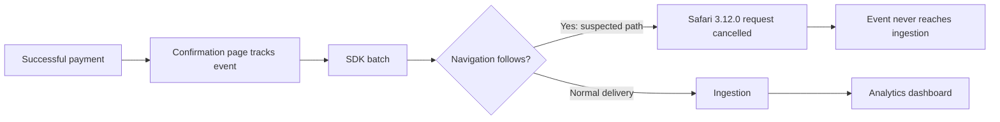

# 🟠 Triage Report: SUP-1001 — Safari checkout events missing

**Ticket:** SUP-1001
**Customer:** Acme Analytics (synthetic)
**Issue Type:** Bug
**Product Area:** Browser SDK event delivery at page transitions
**Priority:** 🟠 P2
**Plan Tier:** Unknown
**SLA Target:** Not supplied
**Environment:** Next.js; Safari 17/18; browser SDK 3.12.0; US region
**Investigation Mode:** Read-only, offline synthetic fixtures; reviewed 2026-10-07

## 📖 Context for Reviewers

The customer wants successful checkouts recorded in analytics. Browser SDK delivery is documented in `mock-sources/docs/browser-sdk.md`. About half of Safari checkout events reportedly disappear after a frontend deployment, while Chrome behaves normally. Payment confirmation still appears; payment processing failure is not reported [E1].

## Issue Summary

The customer reports missing `checkout_completed` events beginning around 2026-04-28 14:00 UTC after frontend deployment `2026.04.28.2`. Safari 17 and 18 are affected with browser SDK 3.12.0; Chrome looks normal [E1]. A known navigation-time SDK regression closely matches, but customer-specific causality remains unverified [E2].

## Intake

ASSUMING: Next.js with Beacon browser SDK v3.12.0, US region, unknown plan, and multiple Safari users affected.
→ Correct me now or I proceed with these.

| Field | Value |
|---|---|
| Issue Type / Product Area | Bug / browser SDK event delivery |
| Timeframe | Reported start 2026-04-28 14:00 UTC; ticket says “yesterday,” interpreted relative to its historical report, not this session. Current persistence unknown. |
| Impact | Reportedly about half of Safari checkout completion events; Chrome normal; one organization known. |
| Environment | Safari 17/18, Next.js, SDK 3.12.0, frontend 2026.04.28.2, US; OS, Next.js version, hosting and plan unknown. |
| Identifiers | SUP-1001; checkout_completed |
| Reproduction | After payment succeeds, confirmation page fires event; event absent from analytics for roughly half of Safari users. Exact navigation sequence unknown. |
| Missing Context | Sanitized event/redirect snippet, runtime beacon.version, whether symptoms persist, and sanitized network evidence if still reproducible. |

## Evidence Gathered

| # | Source / Query | Finding | Status |
|---|---|---|---|
| E1 | `tickets/001-safari-checkout-events.md`, full read | Browser/version, deployment correlation, reported impact and successful confirmation page. Customer observations are reported, not independently reproduced. | ✅ Verified ticket contents |
| E2 | `mock-sources/issues/BEACON-142.md`, full read | Closed/fixed; 3.12.0 navigation-time drops in Safari 17/18, Chrome unaffected, 30–60% session loss. Describes keepalive cancellation before ingestion and no client error; documents two workarounds and fix in 3.12.2. | ✅ Verified fixture |
| E3 | `mock-sources/docs/browser-sdk.md`, full read | Batches flush every 3 seconds, at 20 events, and page hide; documents beacon transport or awaited flush before navigation; beacon.version runtime check. | ✅ Verified fixture |
| E4 | `mock-sources/releases/browser-sdk.md`, full read | 3.12.0 released April 24 changed unload transport/lifecycle; 3.12.1 fixes identify typing; 3.12.2 on May 4 fixes Safari navigation drops. | ✅ Verified fixture |
| E5 | `mock-sources/issues/BEACON-118.md`, full read | Identity resets rather than event delivery failure. | ✅ Verified fixture |
| E6 | `mock-sources/issues/BEACON-160.md` and `mock-sources/status/incidents.md`, full reads | May 2 dashboard incident scoped to EU; April 11 ingestion delay resolved, no loss. Neither matches reported US April 28 onset. | ✅ Verified fixture |
| E7 | Four rg searches over `mock-sources/issues`; exact commands below | Full local search matrix completed; strongest candidate BEACON-142. | ✅ Verified searches |
| E8 | Customer-system evidence availability | No customer logs, network traces, event rows, source code or reproduction supplied; no customer data connector used. | ❌ Unverified customer-specific delivery path |
| E9 | `mock-sources/README.md`, full read | Sources are synthetic offline stand-ins; not live product records. | ✅ Verified fixture |

## 🐛 Known-Issue Search

All queries below were executed against `mock-sources/issues`, the only tracker represented in this workspace.

| # | Query type | Repo / tracker | Exact executed command | Best Candidate | Conclusion |
|---|---|---|---|---|---|
| 1 | Hybrid (local synonym approximation) | Local issue fixtures | `rg -n -i 'Safari\|WebKit\|navigation\|redirect\|missing\|drop\|completion' mock-sources/issues` | BEACON-142 | Accept as plausible match: browser, version, event-loss rate and confirmation flow. |
| 2 | Broad lexical | Local issue fixtures | `rg -n -i 'Safari\|checkout\|flush\|beacon' mock-sources/issues` | BEACON-142; BEACON-118 | Delivery candidate accepted; identity candidate rejected. |
| 3 | Exact surface | Local issue fixtures | `rg -n -F -e 'checkout_completed' -e '3.12.0' -e 'sendBeacon' -e 'flush' mock-sources/issues` | BEACON-142 | Version and transport match; literal checkout_completed has no hit, which does not reject a general delivery bug. |
| 4 | Recent sweep | Local issue fixtures | `rg -n -e '^updated:' -e '^created:' -e 'Safari' -e '3.12' mock-sources/issues` | BEACON-142 | Created April 29, one day after reported onset; updated May 4. BEACON-160 updated May 2 but region/symptom mismatch. |

**Candidate inspection:** Full bodies of all five issue fixtures read. BEACON-142 accepted provisionally; required immediate-navigation condition not established. BEACON-118 rejected because events still arrive and only identity continuity changes [E5]. BEACON-160 rejected because EU-only dashboard rendering starts May 2 [E6]. BEACON-151 concerns webhook signature verification; BEACON-097 concerns CSV limits; neither matches browser delivery.
**Search gaps:** No live tracker/source history, correlated repository, semantic index or framework docs represented. Offline mode uses local synonym grep in place of semantic hybrid search. Findings are fixture-backed, not externally validated.

## 🗺️ How It Works (and Where It Breaks)

The documented SDK batches events [E3]. BEACON-142 describes Safari cancellation of unload-time keepalive requests [E2]; the broken step below is hypothetical for this customer.

## 🎯 Root-Cause Assessment

**Assessment:** Likely BEACON-142, an SDK 3.12.0 regression dropping Safari events immediately before navigation.

**Confidence:** Likely based on pattern match

**Reasoning:** E1 matches E2 on SDK version, browsers, Chrome comparison, confirmation-event timing and approximate loss rate. E4 independently records the fix in 3.12.2. E3 supports the documented workarounds. However, E8 leaves the customer's actual navigation/transport path unknown. Confidence limited by lack of project data access. Documentation and a known issue cannot confirm this customer's cause; the plausible-candidate cap is Medium (70%).

**Not explained:** Whether a redirect, route change or page hide follows the event; exact loss rate; prior SDK version; changes elsewhere in the frontend deployment; persistence since the historical report.

## Recommended Next Action

1. Verify runtime `beacon.version`, obtain sanitized event/redirect code and confirm whether the problem persists [E3, E8].
2. Test SDK 3.12.2 in the same flow; this is the recorded fix, available May 4, after the original April 28 onset [E4]. Do not imply 3.12.1 fixes delivery.
3. If an interim mitigation is needed, use `{ transport: 'beacon' }` for the relevant `beacon.track()` call, or `await beacon.flush()` before navigating; both are documented [E2, E3]. Validate delivery rather than assuming success.
4. If loss persists on 3.12.2 or occurs without navigation, provide the embedded escalation brief and sanitized network evidence to engineering. No configuration changes or customer-system actions were performed.

### Reproduction (status: not yet run)

**Environment:** Next.js, Safari 17/18, SDK 3.12.0, US; OS and plan unknown.
**Preconditions:** Human-run test checkout with synthetic data; event code and navigation timing obtained first.

1. Complete a test payment and reach the confirmation page (source: ticket).
2. Fire `checkout_completed` using the existing event call (source: ticket).
3. Follow the application's immediate redirect/route change if one exists (source: assumed; confirmation required).
4. Check the sanitized network record and whether the event appears in analytics (source: ticket observation plus proposed verification).

**Expected:** Checkout event delivered; navigation-safe delivery is documented [E3].
**Actual:** Customer reports roughly half of Safari events absent, Chrome normal [E1]; no reproduction performed.
**Control:** Repeat identical flow in the same Safari version with only SDK changed to 3.12.2; expected restored navigation delivery per E4. Chrome is an additional browser comparison, not part of that one-variable control.
**Frequency:** Intermittent, approximately half of Safari users; no measured trial count provided [E1].

## Escalation Decision

**Decision:** Prepare engineering escalation for the P2 delivery regression; a human should correlate with the existing fixed issue and validate remediation before filing a duplicate.
**Reason:** Substantial conversion-event loss is reported and a product defect plausibly matches [E1, E2]. Customer-specific transport evidence is missing.
**Suggested owner:** Browser SDK delivery team (suggested, ownership unverified).
**Follow-up cadence:** After runtime/code confirmation and fixed-version test; no timeline promised.
**Action status:** Brief prepared below; nothing filed, sent or reproduced.

## 🔎 Verify This Report

1. Read `mock-sources/issues/BEACON-142.md`: confirm Safari 17/18, 3.12.0, navigation condition, loss rate and documented workarounds.
2. Read `mock-sources/releases/browser-sdk.md`: confirm 3.12.2 fixes delivery on May 4 and 3.12.1 only addresses typing.
3. Read `mock-sources/docs/browser-sdk.md`: verify transport option, awaited flush and runtime version check.
4. Have a human compare the sanitized event call and navigation sequence with BEACON-142; repeat the same synthetic flow on 3.12.2. Requests leaving the browser and events appearing in analytics would support remediation.
5. Compare E6 dates and regions against the ticket before considering dashboard or ingestion incidents.

## 💬 Draft Customer Response

Hi,

Thanks for including the Safari versions, SDK version, and deployment time. This looks consistent with a documented SDK 3.12.0 regression that can drop events sent immediately before navigation in Safari 17 and 18. We still need to confirm whether your checkout flow reaches that delivery path.

The release notes record a fix in SDK 3.12.2. Please test that version with the same checkout flow. If you need an interim workaround, the documented options are to pass `{ transport: 'beacon' }` to the event's `beacon.track()` call, or use `await beacon.flush()` before navigating.

Could you share a sanitized snippet showing the event call and any following redirect or route change, plus the result of `beacon.version` from an affected browser? Please also confirm whether the issue is still occurring. If it persists with the fixed version, a support engineer will need to review a sanitized network trace to distinguish this regression from another cause.

--- END OF CUSTOMER-FACING CONTENT ---

## 🔬 Evidence Pack (internal only)

Pre-send spot check: all cited references verified.
This verifies references against synthetic fixtures, not live behavior or customer causality.

### Engineer TL;DR

Likely Safari navigation-time event loss from SDK 3.12.0, already recorded as fixed in 3.12.2. Confirm the missing immediate-navigation condition and actual runtime version; validate the documented fix or workaround. No reproduction or escalation transmission occurred.

### Claim-Source Map

| # | Claim | Source (row #) | Status |
|---|---|---|---|
| 1 | Ticket reports Safari loss after April 28 deployment with SDK 3.12.0 | E1 | Verified |
| 2 | Known issue matches Safari/version/loss pattern | E2 | Verified |
| 3 | Issue describes keepalive cancellation before ingestion and no client error | E2 | Verified as issue description, not customer observation |
| 4 | Docs support beacon transport or awaited flush before navigation | E2, E3 | Verified |
| 5 | 3.12.2 records Safari delivery fix; 3.12.1 does not | E4 | Verified |
| 6 | Inspected identity and EU candidates mismatch this ticket | E5, E6 | Verified source scope |
| 7 | Four local search types completed | E7 | Verified |
| 8 | This customer's root cause is BEACON-142 | E1, E2, E8 | Inferred |
| 9 | Immediate navigation follows this customer's event | E8 | Unverified |
| 10 | Historical issue persists now | E8 | Unverified |

**Contradiction check:** No fixture contradicts the leading pattern; absence of navigation evidence prevents confirmation. “Yesterday” is historical ticket wording. Fix release postdates original report and is not portrayed as available then. No inference of lost events being recoverable is made.

### Unknowns

Navigation timing; current SDK; earlier SDK version; OS; exact event-call code; network outcomes; ingestion rows; measured trial counts; current persistence. No source-code implementation inspection, browser run or customer-system query occurred.

### Confidence Score

**Overall:** Medium, 70% after cap.
Verified: 7; inferred: 1; unverified: 2. Raw score: (7 + 0.5) / 10 × 100 = 75%.
Caps applied: plausible matching issue not confirmed or ruled out → Medium (70%). Search matrix complete in offline mode. Customer root cause remains inferred.

### Escalation Brief (prepared, not filed)

**Ticket:** SUP-1001
**Customer Impact:** Reportedly about half of Safari checkout events missing at one organization.
**Severity:** High / P2
**Suggested Owner:** Browser SDK delivery team, unverified ownership
**Filed by support:** Not filed; prepared for human review
**Date:** 2026-10-07

**Summary:** Check whether this historical report is BEACON-142 and whether the fixed SDK resolves it. Confirmation requires navigation timing and sanitized network evidence.

| Impact field | Value |
|---|---|
| Affected customers | One reported organization; broader scope unknown |
| Estimated blast radius | About half of Safari checkout users, customer estimate |
| First seen | 2026-04-28 14:00 UTC / frontend 2026.04.28.2 |
| Regression | Reported after frontend/SDK upgrade; previous SDK unknown |
| Production-down | Not reported; payment confirmation works |
| Workaround available | Documented transport/flush options; untested here |

**Reproduction:** Use the unchanged reproduction under Recommended Next Action; not yet run. Smallest missing piece: event code plus subsequent navigation timing.
**Expected / Actual:** Documented navigation-safe event delivery vs reported Safari analytics absence [E1, E3].
**Evidence:** E1–E4 support correlation; E8 limits confirmation.
**What support already checked:** Local tracker matrix; all five issue bodies; browser delivery docs; release notes; status history. No customer configuration altered or reproduction run.
**Closest known issues:** BEACON-142 closed/fixed in 3.12.2, strong conditional match; BEACON-118 rejected identity scope; BEACON-160 rejected date/region scope.
**Specific ask:** Confirm the flow enters the known failing transport path; review a sanitized request trace if 3.12.2 still loses events or navigation is absent.
**Workaround:** Documented beacon transport on event call or awaited flush before navigation [E2, E3].

### Redaction confirmation

Redaction pass: 0 replacements made across both generated outputs. No tokens, personal properties, email addresses, private URLs or admin links included. Customer draft excludes internal paths, tracker IDs and tooling.

