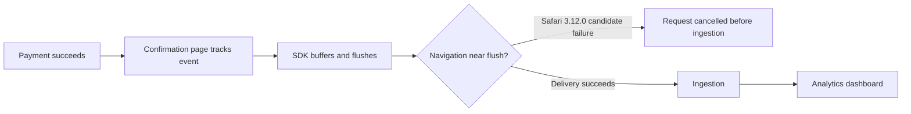

# 🟠 Triage Report: SUP-1001 — Safari checkout events missing

**Ticket:** SUP-1001  
**Customer:** Acme Analytics (synthetic organization)  
**Issue Type:** Bug  
**Product Area:** Browser SDK event delivery during page lifecycle transitions  
**Priority:** 🟠 P2  
**Plan Tier / SLA:** Unknown  
**Environment:** Next.js, Safari 17/18, browser SDK 3.12.0, US  
**Investigation Mode:** Read-only, offline fictional Beacon fixtures; reviewed 2026-10-07

## 📖 Context for Reviewers

The customer wants successful payments to appear as `checkout_completed` events. The [browser delivery guide](../mock-sources/docs/browser-sdk.md) describes batching and flushing events around navigation. About half of Safari users reportedly reach the confirmation page without a corresponding analytics event; Chrome appears normal. No customer logs or project access were provided.

## Issue Summary

The customer reports Safari-only missing checkout events since frontend deployment `2026.04.28.2` at 2026-04-28 14:00 UTC. SDK 3.12.0 and Safari 17/18 align closely with BEACON-142, but the required navigation timing has not been verified (E1–E3).

## Intake

| Field | Value |
|---|---|
| Issue Type / Product Area | Bug / browser event delivery |
| Timeframe | Reported onset 2026-04-28 14:00 UTC after deployment; current persistence unknown. “Yesterday” is ticket wording, not relative to investigation date. |
| Impact | Reportedly about half of Safari users; Chrome normal. Payment succeeds; analytics visibility is impaired. |
| Environment | Next.js; Safari 17/18; SDK 3.12.0; US; OS, Next.js version, plan and hosting unknown. |
| Identifiers | SUP-1001; checkout_completed; frontend 2026.04.28.2 |
| Reproduction | Payment succeeds → confirmation page sends event → dashboard lacks event for roughly half of Safari users. Customer report only. |
| Missing Context | Sanitized event/navigation code; deployed runtime SDK version; one sanitized Safari network capture; whether earlier events arrive. |

## Evidence Gathered

| # | Source / Query | Finding | Status |
|---|---|---|---|
| E1 | [Ticket](../tickets/001-safari-checkout-events.md), full read | Browser, version, event, onset and impact above are customer-reported, not independently measured. | ✅ Verified as ticket content |
| E2 | [BEACON-142](../mock-sources/issues/BEACON-142.md), full body | Closed/fixed in 3.12.2; Safari 17/18 events before transitions dropped since 3.12.0; reported 30–60% confirmation/conversion loss. Describes cancelled keepalive requests and no client error for that issue. | ✅ Verified fixture |
| E3 | [SDK releases](../mock-sources/releases/browser-sdk.md), full read | 3.12.0 released April 24 changed unload transport/lifecycle trigger; 3.12.2 released May 4 fixes Safari navigation losses. 3.12.1 fixes identify types. | ✅ Verified fixture |
| E4 | [Delivery guide](../mock-sources/docs/browser-sdk.md), full read | Flush every 3 seconds, at 20 events, or on page hiding; documented beacon transport override or awaited flush before navigation; runtime version check is beacon.version. | ✅ Verified fixture |
| E5 | [BEACON-118](../mock-sources/issues/BEACON-118.md), full body | Identity continuity issue explicitly does not prevent event delivery. | ✅ Verified fixture |
| E6 | [BEACON-160](../mock-sources/issues/BEACON-160.md) and [status history](../mock-sources/status/incidents.md), full reads | May 2 dashboard incident scoped to EU; April 11 ingestion delay resolved, with no data loss. Neither matches reported US April 28 Safari-specific onset. | ✅ Sources verified; exclusion is pattern-based |
| E7 | Customer evidence unavailable | Navigation after capture, cancellation in this customer flow, ingestion receipt and fix effectiveness have not been observed. | ❌ Unverified |
| E8 | [BEACON-151](../mock-sources/issues/BEACON-151.md), [BEACON-097](../mock-sources/issues/BEACON-097.md), full reads | Webhook signature and CSV cap topics do not match browser event delivery. | ✅ Verified fixture |

## 🐛 Known-Issue Search

All commands below were executed this session against `mock-sources/issues/`; offline hybrid means synonym/paraphrase grep, not a semantic search service.

| # | Query type | Tracker | Exact executed query | Candidate / conclusion |
|---|---|---|---|---|
| 1 | Hybrid | Local issues | `rg -n -i 'Safari\|WebKit\|missing\|drop\|navigation\|confirmation\|checkout' mock-sources/issues` | BEACON-142 accepted as likely match; BEACON-118 rejected for delivery symptoms |
| 2 | Lexical | Local issues | `rg -n -i 'Safari\|flush\|batch\|keepalive' mock-sources/issues` | BEACON-142 strongest; CSV batching in BEACON-097 unrelated |
| 3 | Exact | Local issues | `rg -n -F -e 'checkout_completed' -e '3.12.0' -e 'sendBeacon' mock-sources/issues` | Version/transport match BEACON-142; no exact checkout_completed match |
| 4 | Recent | Local issues | `rg -n 'updated:\|created:\|Safari\|3.12' mock-sources/issues` | Compared dates: 142 updated May 4, created April 29, near April 28 onset; 160 May 2; 151 May 1; 097 April 22; 118 January 8 |

**Matching issue / release:** BEACON-142, closed/fixed; SDK 3.12.2 (E2–E3). Browser/version/frequency match; navigation timing remains unverified.

**Closest rejected candidates:** BEACON-118 changes identity rather than delivery (E5). BEACON-160 concerns EU dashboard caching, different date and scope (E6). BEACON-151 and BEACON-097 concern unrelated product areas (E8).

**Search gaps:** No separate correlated repository or source code exists in supplied fixtures; no project-data connector or customer artifact was available. No web search was performed for fictional Beacon.

## 🗺️ How It Works (and Where It Breaks)

Documented flow and candidate failure, not an observed customer trace (E2–E4):

BEACON-142 attributes the issue to the switch from sendBeacon/pagehide to fetch keepalive/visibilitychange and says cancelled requests never reach ingestion, without a client error. Those statements describe the known issue, not verified behavior in this customer's project.

## 🎯 Root-Cause Assessment

**Assessment:** The reported loss likely matches BEACON-142, the SDK 3.12.0 Safari navigation-time delivery regression.

**Confidence:** Likely based on pattern match

**Reasoning:** Browser majors, SDK version, Chrome control, confirmation-page symptom, approximate loss rate and deployment timing align with E1–E3. Direct customer cancellation evidence is absent (E7). Confidence is limited by lack of project data access.

**Not explained:** The ticket does not establish navigation or page hiding immediately after capture. If the page stays open through a flush, the candidate may not explain the loss. Current persistence and whether earlier events arrive are unknown.

## Recommended Next Action

1. Ask for the sanitized capture/navigation snippet and confirm deployed version using the documented `beacon.version` check (E4).
2. Recommend testing SDK 3.12.2, the documented fixed release (E3). It became available May 4, after the reported April 28 onset; this is a present-day recommendation.
3. Interim documented options: pass `{ transport: 'beacon' }` to the affected track call, or await `beacon.flush()` before navigation (E2/E4). Do not claim these have been tested in this flow.
4. If loss persists on the fixed release, collect one sanitized Safari network trace and refer to browser SDK engineering.

### Reproduction (status: not yet run)

**Environment:** Reported Next.js/Safari 17 or 18/SDK 3.12.0/US; OS and plan unknown.  
**Preconditions:** Synthetic checkout; existing integration; event code still needed.

1. Complete a synthetic successful payment and reach confirmation (source: ticket).
2. Send checkout_completed using the customer's sanitized integration (source: ticket; implementation missing).
3. Trigger the same immediate navigation, if present in their flow (source: assumed candidate condition from E2; confirm before treating as reproduction).
4. Observe network delivery and analytics appearance (source: proposed verification).

**Expected:** Tracked events deliver via the documented lifecycle path (E4).  
**Actual:** Customer reports about half missing in Safari (E1); network cancellation is not observed.  
**Control:** Repeat identical Safari steps with only SDK changed to 3.12.2; candidate predicts delivery restored (E3). Chrome on 3.12.0 is a secondary browser control.  
**Frequency:** Customer estimate roughly 50%; no measured n/m.

## Escalation Decision

**Decision:** Prepare conditional engineering handoff; no external escalation sent.

**Reason:** P2 analytics loss and strong known defect match warrant a ready brief. First obtain the minimum timing evidence and test the documented fix; escalate if losses continue on 3.12.2 or evidence contradicts the candidate.
**Suggested owner:** Browser SDK engineering (suggested, not verified ownership).
**Follow-up cadence:** Review when requested artifacts or test results arrive; no timeline promised.

### Prepared Escalation Brief

**Ticket / severity / date:** SUP-1001 / High (P2) / 2026-10-07  
**Summary:** Verify whether the customer flow hits BEACON-142, or a separate delivery defect if SDK 3.12.2 still loses events.  
**Customer impact:** One reporting organization, roughly half of Safari checkouts missing from analytics; no reported payment failure; first seen April 28 14:00 UTC after frontend deployment.  
**Reproduction:** Use the unrun steps above; immediate-navigation condition and sanitized code remain missing.  
**Expected vs actual:** Successful delivery versus customer-reported missing analytics events; no customer network trace.  
**Evidence:** E1 customer report, E2 known regression, E3 fixed release, E4 documented workaround.  
**Support checks:** Completed four search modes, inspected all five issue fixtures, checked docs/releases/status; no code changes, workaround trials or customer-system requests executed.  
**Closest issue:** BEACON-142 closed/fixed, strong symptom/version match; BEACON-118 and 160 rejected for stated scope differences.  
**Specific ask:** Confirm capture-to-navigation timing and whether a post-upgrade Safari trace shows the event request reaching ingestion; investigate a separate regression if loss persists.  
**Workaround:** Documented beacon override or awaited flush, pending customer verification.

## 🔎 Verify This Report

1. Open [BEACON-142](../mock-sources/issues/BEACON-142.md): check affected browsers, version, cancellation description and fixed_in.
2. Open [release notes](../mock-sources/releases/browser-sdk.md): check April 24 transport change and May 4 fix.
3. Open [delivery docs](../mock-sources/docs/browser-sdk.md): check transport override, awaited flush and version check.
4. Review the customer's sanitized snippet and Safari trace: establish navigation timing and delivery outcome; rerun with only SDK changed to 3.12.2.

## 💬 Draft Customer Response

Hi,

The Safari versions, SDK version, and missing confirmation-page events you described match a documented event-delivery regression in browser SDK 3.12.0. It affects events sent immediately before navigation; we still need to confirm whether that timing applies to your checkout flow.

The release notes document a fix in SDK 3.12.2. Please upgrade to that version and compare a test checkout in Safari with Chrome. If you need an interim workaround, the delivery guide recommends passing `{ transport: 'beacon' }` to `beacon.track()` for the affected event, or calling `await beacon.flush()` before redirecting.

Could you share a sanitized snippet showing where `checkout_completed` is sent and whether a redirect, route change, or tab close follows it? If it still fails after upgrading, please include one sanitized Safari network capture and the deployed SDK version from `beacon.version` so an engineer can confirm the delivery path.

--- END OF CUSTOMER-FACING CONTENT ---

## 🔬 Evidence Pack (internal only)

Pre-send spot check: all cited references verified.

### Engineer TL;DR

Strong known-regression match; customer root cause remains inferred. Obtain event/navigation timing and verify the documented fixed release before claiming resolution. No project query, browser reproduction, external escalation or message was performed.

### Claim-Source Map

| # | Claim | Source | Status |
|---|---|---|---|
| 1 | Customer reports Safari 17/18, SDK 3.12.0, about half missing | E1 | Verified as report only |
| 2 | Known issue affects those browsers/version before navigation | E2 | Verified |
| 3 | Known issue describes cancellation before ingestion and no client error | E2 | Verified; not customer-specific |
| 4 | 3.12.0 changed transport and lifecycle trigger | E3 | Verified |
| 5 | 3.12.2 documents fix | E2/E3 | Verified |
| 6 | Beacon override or awaited flush is documented | E2/E4 | Verified |
| 7 | Runtime version check is beacon.version | E4 | Verified |
| 8 | ITP candidate concerns identity rather than delivery | E5 | Verified |
| 9 | Listed incidents differ in date or region | E6 | Verified |
| 10 | Customer loss likely caused by BEACON-142 | E1–E3/E7 | Inferred |

### Unknowns

Navigation/page-hide timing, deployed runtime version, request fate, current impact, post-fix results, OS, Next.js version, plan and earlier-event behavior. No source-code inspection; issue-body internals are attributed to the issue. No claim of restored missing historical events.

### Confidence Score

**Overall:** Medium, 70% after cap.

- Verified claims: 9
- Inferred claims: 1
- Unverified scored claims: 0 (unknowns excluded; not asserted)
- Arithmetic: (9 + 0.5) / 10 = 95%.
- Caps applied: plausible matching candidate not definitively established or ruled out → Medium (70%). Search gate complete; root cause inferred rather than confirmed.

### Anti-hallucination and contradiction review

Claims mapped above; versions, workaround API, issue state and no-error statement checked against fetched fixtures. Ticket is distinguished from independent customer evidence. No contradiction between known issue and release notes; navigation is the unresolved condition. Later release/issue updates are retrospective evidence, not claimed to have been available at onset. Customer reply contains no fixture paths, internal tracker names, invented URLs, timelines or ungrounded fix recipe.

### Redaction confirmation

Redaction pass: 0 replacements made across 2 files. Reviewed for tokens, secrets, PII, private links, admin links and raw person properties; none included. Synthetic organization label remains internal. Customer draft contains no emojis or internal-only details.

