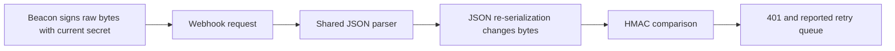

# 🟠 Triage Report: SUP-1002 — Webhook signature failures
**Ticket:** SUP-1002  
**Customer:** Northwind Retail (synthetic)  
**Issue Type:** Integration / bug-shaped regression  
**Product Area:** Webhook signature verification  
**Priority:** 🟠 P2  
**Plan / region / runtime versions:** Unknown  
**Investigation Mode:** Read-only, offline fixtures; no customer resources accessed.

## 📖 Context for Reviewers
The customer needs order webhooks accepted by their order service. After rotating a signing secret and deploying shared Express middleware, the service rejects deliveries with HTTP 401. [Webhook guide](../mock-sources/docs/webhooks.md) describes signing the original request bytes.

## Issue Summary
The customer reports every webhook failing since 2026-04-30 and a growing retry queue. Their verifier computes HMAC-SHA256 over JSON.stringify(req.body), with global express.json() middleware. Supplied logs show a successful delivery before build 2291 and mismatches afterward, including after the secret reload. Permanent event loss is reported as a concern, not established by the logs.

## Intake
ASSUMING: Node.js/Express order service, region and plan unknown, one customer’s webhook endpoint affected.
→ Correct me now or I proceed with these.

| Field | Value |
|---|---|
| Timeframe | Started 2026-04-30 afternoon; supplied logs 13:58:41–14:21:30 UTC. Current state not independently checked. |
| Impact | Customer reports all order-service webhooks rejected and growing retry queue; global blast radius unknown. |
| Environment | Node.js crypto, Express, shared JSON middleware; versions and hosting unknown. |
| Identifiers | SUP-1002; build 2291; dlv_7781, dlv_7790, dlv_7791; order.paid, order.created. |
| Reproduction | Rotate secret, deploy shared JSON middleware, compute HMAC over re-serialized JSON, observe 401. No independent run. |
| Missing Context | Middleware order; one post-change test result; exact rotation time; endpoint/environment binding; queue retention and recovery state. |
| Sensitive inputs | Signing secret and contact PII omitted. |

## Evidence Gathered
| # | Source / Query | Finding | Status |
|---|---|---|---|
| E1 | tickets/002-webhook-signature-failures.md, code and customer narrative | Global express.json() reported; verifier signs JSON.stringify(req.body). Every webhook failure and retry growth are customer reports. | ✅ Verified as supplied evidence; operational state unverified |
| E2 | Same ticket, UTC log excerpt | 13:58:41 delivery 200; 14:02:10 build 2291; 14:03:55 and 14:04:02 mismatches; 14:20:17 secret reload; 14:21:30 dlv_7790 attempt 3 still 401. | ✅ Verified as supplied log, not independent telemetry |
| E3 | [Webhook guide](../mock-sources/docs/webhooks.md) | Beacon-Signature is hex HMAC-SHA256 over raw body. Route-specific express.raw recommended. New secret used immediately; previous-secret header available 24 hours. Timestamp older than 5 minutes should be rejected. | ✅ Verified fixture documentation |
| E4 | [BEACON-151](../mock-sources/issues/BEACON-151.md), full body | Same global JSON-parser / re-serialization pattern; workaround verifies raw Buffer then parses. Open documentation issue, explicitly classified there as not a product defect. | ✅ Verified fixture issue |
| E5 | [Incident history](../mock-sources/status/incidents.md) | Listed incidents concern April 11 ingestion and May 2 EU dashboards; neither matches this endpoint signature failure window. | ✅ Verified limited fixture history |
| E6 | [Browser releases](../mock-sources/releases/browser-sdk.md) and inspected issue bodies | Release fixes concern browser behavior, not webhook signing. BEACON-142 concerns Safari requests never reaching ingestion. | ✅ Verified sources |
| E7 | Customer telemetry / signing configuration / reproduction | No project-data connector was used; no raw request comparison or test performed. | ❌ Unverified |

## 🐛 Known-Issue Search
All searches executed with rg against mock-sources/issues/. Hybrid here means synonym/paraphrase discovery, not a semantic search engine.

| # | Query type | Tracker | Exact query / procedure | Best Candidate | Conclusion |
|---|---|---|---|---|---|
| 1 | Hybrid | mock-sources/issues/ | rg -n -i 'signature\|verification\|unauthorized\|raw.body\|rotation\|signing\|401\|middleware' | BEACON-151 | Accepted: parsed-body verification failures match code and symptoms. |
| 2 | Lexical | Same | rg -n -i 'webhook\|signing secret\|retry\|hmac' | BEACON-151 | Accepted: same signing component. |
| 3 | Exact | Same | rg -n -F -e 'Beacon-Signature' -e 'signature mismatch' -e 'express.json()' -e 'JSON.stringify' | BEACON-151 | express.json() matches; other exact strings returned no matches. |
| 4 | Recent | Same | rg -n '^(updated\|created\|title\|status):\|webhook\|rotation\|signature'; compare returned dates with April 30 onset | BEACON-151, updated May 1 | Created March 2, updated immediately after ticket onset; matching pattern predates incident. |

**Matching issue:** BEACON-151 is an open docs improvement, not evidence of a confirmed Beacon signing defect. Full body inspected.
**Closest rejected candidates:** BEACON-142 (closed/fixed) concerns Safari browser delivery, whereas these requests reach the service and return 401; BEACON-160 (open) concerns EU dashboard cache tiles, not signature verification. Full bodies inspected. BEACON-118 and BEACON-097 also inspected and concern identity and CSV exports.
**Search gaps:** Offline tracker only; no live customer configuration, webhook-server source, or webhook release history supplied. Browser release notes do not establish webhook change history. No web search for fictional Beacon.

## 🗺️ How It Works (and Where It Breaks)

Likely break: signing re-serialized JSON rather than original bytes (E1, E3, E4). Correct path verifies the raw Buffer before parsing. The excerpt compares only Beacon-Signature; it does not use the separate previous-secret header.

## 🎯 Root-Cause Assessment
**Assessment:** Parsed-body re-serialization is the leading explanation for the signature failures. Secret rotation remains a secondary configuration hypothesis.
**Confidence:** Likely based on pattern match
**Reasoning:** E1 directly shows a verifier inconsistent with E3, and E4 documents the same middleware failure pattern. E2 places the first logged mismatch after deployment and shows persistence after secret reload. These establish a code/documentation mismatch but do not prove the exact failing bytes or deployed endpoint configuration. Confidence limited by lack of project data access; plausible matching issue not independently validated here caps confidence at Medium (70%).
**Not explained:** Whether the configured secret is correct for this endpoint, whether rotation preceded the first error, whether all payloads changed bytes, whether queued events remain recoverable, and whether timestamp validation is implemented elsewhere.

## Recommended Next Action
1. 🔧 For operator/customer review: mount route-specific express.raw({ type: 'application/json' }) before shared express.json() consumes webhook requests; compute the HMAC over the Buffer and parse only after successful verification (E3, E4). No code or deployment changed during triage.
2. Confirm the current signing secret is bound to the correct endpoint/environment without sharing its value. Beacon-Signature uses the new secret immediately; Beacon-Signature-Previous is a separate 24-hour overlap mechanism (E3). Do not assume that historical overlap remains available.
3. Verify one test delivery, then ask the delivery owner to confirm retry retention and recovery options. Do not promise event recovery or prescribe undocumented replay operations.
4. If the raw-byte verifier with the correct current secret still fails, obtain the minimal sanitized artifact and escalate for signing configuration investigation.

### Reproduction (status: not yet run)
**Environment:** Node.js/Express; versions, region and plan unknown.
**Preconditions:** Isolated test endpoint using synthetic order data and a securely configured current secret; exact setup assumed, not executed.
1. Mount the shared JSON parser before the webhook handler (source: ticket).
2. Send a synthetic signed JSON request with whitespace that differs from JSON.stringify output; sign its original bytes (source: docs; payload choice assumed).
3. Verify using the supplied re-serialization approach and record status (source: ticket).
**Expected:** Raw-byte HMAC with the correct secret matches (E3).
**Actual:** Customer reports 401; supplied excerpt records mismatches (E1, E2).
**Control:** Keep the same payload, secret and header, changing only the parser/verifier path to preserve and sign raw bytes; expected successful verification (E3, E4).
**Frequency:** Customer reports every webhook; three mismatch log lines supplied, including one retry.

## Escalation Decision
**Decision:** Request the minimal verification result first; conditional engineering escalation if failures persist or queue recovery is urgent.
**Reason:** Strong documented integration match, no confirmed signing defect. Missing raw-byte test and endpoint binding prevent a precise product escalation.
**Suggested owner:** Webhook delivery/signing engineering, if triggered.
**Follow-up cadence:** Review the next test result; no promised timeline. No escalation was filed.

## 🔎 Verify This Report
1. [ ] Open [webhook docs](../mock-sources/docs/webhooks.md): confirm raw-byte HMAC and the two rotation headers.
2. [ ] Open [BEACON-151](../mock-sources/issues/BEACON-151.md): confirm global JSON parsing symptom and raw Buffer workaround.
3. [ ] Compare supplied log timestamps: first logged mismatch follows build 2291 and persists after reload; this supports correlation, not definitive causation.
4. [ ] Inspect middleware ordering and run the synthetic control above: raw bytes must reach verification before JSON parsing.
5. [ ] Confirm a post-change delivery status and queue recovery policy with the responsible operator; no recovery guarantee exists in these sources.

## 💬 Draft Customer Response
Hello,

Thanks for the code and deployment timeline. The likely cause is the body-parser change: Beacon signs the exact raw request bytes, but your verifier signs JSON.stringify(req.body). Parsing and re-serializing JSON can change those bytes, causing verification to fail even with the correct secret.

Mount express.raw({ type: 'application/json' }) on the webhook route before the shared express.json() middleware can consume that request. Compute the HMAC over the resulting Buffer, verify it, and only then parse the JSON.

Rotation uses the new secret immediately; the previous-secret signature is supplied in a separate header for 24 hours. Keep using the current secret for Beacon-Signature.

Please share the middleware order and the delivery ID, timestamp, and HTTP status from one test after this change, without sending secrets or payload contents. If verification still fails, an engineer should check the endpoint’s signing configuration. We cannot yet confirm whether all queued order events remain recoverable.

--- END OF CUSTOMER-FACING CONTENT ---

## 🔬 Evidence Pack (internal only)
✅ Pre-send spot check: all cited references verified.

### Engineer TL;DR
Likely raw-body integration regression matching BEACON-151. Rotation failure is not proved; runtime secret correctness and byte comparison remain unknown. Verify route ordering and one test before deciding on engineering escalation.

### Claim-Source Map
| # | Claim | Source | Status |
|---|---|---|---|
| 1 | Supplied verifier signs re-serialized JSON | E1 | Verified |
| 2 | Supplied failures follow deployment and persist after secret reload | E2 | Verified |
| 3 | Signing contract requires raw bytes | E3 | Verified |
| 4 | Rotation immediately changes primary header; old signature has separate 24-hour header | E3 | Verified |
| 5 | BEACON-151 documents matching pattern and workaround | E4 | Verified |
| 6 | Listed status incidents and browser releases concern other components | E5, E6 | Verified |
| 7 | Middleware change caused these observed failures | E1–E4 | Inferred |
| 8 | Proposed raw-body change will restore this endpoint | E3, E4; runtime untested | Inferred |
| 9 | Current secret and endpoint binding are correct | E7 | Unverified |
| 10 | All queued events are recoverable | E7 | Unverified |

### Unknowns
Raw body bytes; deployed middleware order; endpoint binding; exact rotation time; runtime versions; timestamp checks; queue retention and recoverability. Fixture documentation was fetched this session but has no version/date marker. No customer system was queried. No contradiction between fixture signing docs and matching issue found; simultaneous rotation remains a competing factor.

### Confidence Score
**Overall:** Medium, 70%.
- Verified claims: 6.
- Inferred claims: 2.
- Unverified claims: 2.
- Arithmetic: (6 + 2 × 0.5) / 10 × 100 = 70%.
- Caps applied: plausible matching issue not independently ruled out/validated, Medium (70%). Known-issue matrix complete within offline fixture scope.
- Claim extraction, source mapping, contradiction check and unverified-claim review completed. Customer reply contains no recovery guarantee or claim that rotation is broken.

### Conditional escalation brief
**Ticket:** SUP-1002  
**Severity:** High (P2), customer reports all order-service webhooks failing.  
**Suggested Owner:** Webhook delivery/signing engineering.  
**Filed by support:** Not filed; prepared for operator use.  
**Date:** 2026-10-07 (investigation date; incident April 30).

**Summary / impact:** One reported customer endpoint returns 401 after middleware deployment and signing-secret rotation; growing retry queue reported, permanent loss unverified. Overall production-down status unknown. Raw-body workaround available but not tested.
**Reproduction:** Use the unchanged numbered synthetic reproduction and control under Recommended Next Action. No run performed; middleware order and current endpoint binding needed.
**Expected / actual:** Raw-byte signature matches (E3); supplied requests return 401 (E2).
**Evidence:** E1 verifier; E2 timeline; E3 signing contract; E4 same integration pattern.
**Support checked:** Full offline search matrix, candidate bodies, docs, incident history and browser releases. No changes or test requests executed.
**Closest known issue:** BEACON-151, open docs issue, strong pattern match; BEACON-142 and BEACON-160 rejected for component mismatch.
**Specific ask if triggered:** Confirm current endpoint signing configuration and signature computation for a sanitized failing delivery after raw-body verification is in place; establish queue retention and supported recovery actions.
**Workaround:** Verify raw Buffer before parsing (E3, E4), pending customer confirmation.

### Redaction confirmation
Redaction pass: 2 sensitive source items omitted before saving across both outputs (signing secret and contact identity/email). No source payload, private URL, credential value or internal admin link copied. Final output scan found no sensitive matches.

