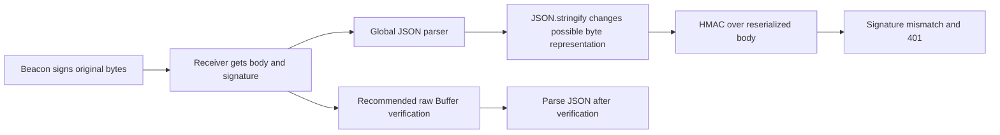

# 🟠 Triage Report: SUP-1002 — Webhook signature failures

**Ticket:** SUP-1002
**Customer:** [redacted-customer]
**Issue Type:** Integration / bug-shaped regression
**Product Area:** Webhook receiver signature verification
**Priority:** 🟠 P2
**Plan Tier / SLA:** Unknown
**Environment:** Node.js crypto, Express; runtime/framework versions, region and hosting unknown
**Investigation Mode:** Read-only, offline synthetic Beacon sources
**Investigation date:** 2026-10-07; historical incident beginning 2026-04-30. Current customer state not checked.

## 📖 Context for Reviewers

The customer needs order events delivered to its order service. [Webhook signing documentation](../mock-sources/docs/webhooks.md) describes how the receiver authenticates requests. The service reportedly rejects every delivery after a middleware refactor and signing-secret rotation, leaving a growing retry queue. No customer systems were accessed.

## Issue Summary

The supplied verifier hashes JSON.stringify(req.body), after global express.json() middleware. This differs from the documented raw-byte input. The logs show failures immediately after build 2291 and another failure after a secret reload. Rotation and middleware changed in the same window, so runtime causation remains unconfirmed (E1–E4).

## Intake

| Field | Value |
|---|---|
| Issue Type / Product Area | Integration; webhook signature verification |
| Timeframe | Last supplied success 2026-04-30 13:58:41 UTC; deployment 14:02:10; first supplied mismatch 14:03:55; continued at 14:21:30. “Yesterday” is relative to the historical ticket, not investigation date. |
| Impact | Customer reports all webhook deliveries rejected with 401, growing retries, and lost order events. Permanent loss and present queue state unverified. |
| Environment | Express shared middleware and Node.js crypto; versions, region, plan, hosting unknown |
| Identifiers | SUP-1002; build 2291; dlv_7781, dlv_7790, dlv_7791; order.paid, order.created |
| Reproduction | Rotate secret, deploy shared JSON parser, hash re-serialized body; expected acceptance, reported every-delivery 401 |
| Missing Context | Exact middleware order; rotation UTC time; deployed secret identity verified privately; one fresh delivery outcome after raw-body correction; queue age/retention and retry signing behavior |

## Evidence Gathered

| # | Source / Query | Finding | Status |
|---|---|---|---|
| E1 | [Ticket](../tickets/002-webhook-signature-failures.md), supplied code and change list | Global express.json() and HMAC over JSON.stringify(req.body), rather than original request bytes | ✅ Verified as supplied code; deployed implementation unverified |
| E2 | Ticket, UTC log excerpt | Success at 13:58:41; deploy 14:02:10; mismatches 14:03:55 and 14:04:02; secret reload 14:20:17; dlv_7790 attempt 3 rejected 14:21:30 | ✅ Verified as supplied logs; causal link inferred |
| E3 | [Webhook docs](../mock-sources/docs/webhooks.md), full read | Beacon-Signature is hex HMAC-SHA256 of raw body; Express guidance uses route-level express.raw; JSON re-serialization prohibited | ✅ Verified documentation |
| E4 | [BEACON-151](../mock-sources/issues/BEACON-151.md), full body | Open documentation issue describes every-webhook 401 after global JSON parsing; recommends raw Buffer verification, then JSON parsing | ✅ Verified issue; customer match inferred |
| E5 | Webhook docs, rotation and timestamps | New secret signs primary header immediately; previous-secret header exists for 24 hours; reject timestamps older than five minutes | ✅ Verified documented behavior, not observed service behavior |
| E6 | [Status](../mock-sources/status/incidents.md) and [releases](../mock-sources/releases/browser-sdk.md), full reads | Listed incidents concern April 11 ingestion and May 2 EU dashboards; browser releases concern browser SDK, not webhook signing | ✅ Verified fixture scope; cannot establish absence of an unlisted incident |
| E7 | All five issue bodies inspected; search matrix below | BEACON-151 is the direct pattern match; other records concern unrelated browser identity/delivery, CSV export and dashboard cache | ✅ Verified search results |
| E8 | Customer-system evidence availability | No live delivery headers/raw bytes, queue records or secret configuration available; no reproduction run | ❌ Unverified customer runtime and recovery |

## 🐛 Known-Issue Search

Tracker searched: mock-sources/issues/ (all five records). Offline synonym matching substitutes for hybrid discovery; no public Beacon web search was performed.

| # | Query type | Tracker | Executed query | Best Candidate | Conclusion |
|---|---|---|---|---|---|
| 1 | Hybrid / synonyms | mock-sources/issues/ | rg -n -i 'signature\|signing\|rotation\|rotate\|raw.body\|payload\|middleware\|401\|retry' mock-sources/issues | BEACON-151 | Accepted pattern match |
| 2 | Broad lexical | Same | rg -n -i 'signature\|rotation\|raw body\|retry' mock-sources/issues | BEACON-151 | Accepted; no rotation-specific match in this fixture set |
| 3 | Exact surface | Same | rg -n -F -e 'Beacon-Signature' -e 'express.json()' -e '401 invalid signature' -e 'JSON.stringify' mock-sources/issues | BEACON-151 | Exact express.json() and 401 invalid signature match; other exact terms returned no hits |
| 4 | Recent sweep | Same | rg -n 'updated:\|created:' mock-sources/issues; compared dates and read all bodies | BEACON-151, updated 2026-05-01 | Predates incident (created March 2); update immediately after incident window |

**Candidate inspection:** BEACON-151 is open and accepted for the body-parser symptom; its “not a product defect” classification applies to that issue, not proof that this customer's rotation is healthy. BEACON-142 is closed/fixed but rejected: Safari browser requests never reach ingestion, unlike received webhooks rejected with 401. BEACON-160 is rejected: dashboard query cache, begins May 2, not April 30 signing. BEACON-118 and BEACON-097 were also inspected and rejected as identity and CSV-export issues respectively (E7).

**Search gaps:** Complete matrix for the supplied offline tracker only. No live backend source, customer project tools or complete incident history. Later fixture updates describe what is available during this investigation, not necessarily what was known on April 30.

## 🗺️ How It Works (and Where It Breaks)

The diagram shows the leading hypothesis, not a reproduced failure. Identical re-serialization is possible for some payloads; original bytes are missing. Mounting raw middleware after an earlier JSON parser cannot recover already consumed original bytes. Put the raw-body webhook handler before the global parser (E1, E3–E4).

## 🎯 Root-Cause Assessment

**Assessment:** The likely primary cause is verification over re-serialized JSON after the middleware refactor. A separate secret/configuration mismatch remains possible.

**Confidence:** Likely based on pattern match

**Reasoning:** E1 contradicts E3's raw-byte requirement and closely matches E4. E2 places first supplied failures 105 seconds after deployment, and a subsequent secret reload did not restore that retry. Neither a fresh raw-body test nor live signing configuration is available (E8). This does not prove rotation is functioning or that only one cause exists. Plausible matching issue not ruled out caps overall confidence at Medium (70%).

**Not explained:** Exact original body differences; whether the deployed key matches this endpoint; timing of rotation relative to first failure; how retries are signed after rotation; queue recovery or permanent event loss.

## Recommended Next Action

1. 🔧 Human operator: place route-level express.raw({ type: 'application/json' }) before shared express.json() consumes webhook requests. Hash the raw Buffer with the current endpoint signing secret and parse only after successful verification. This follows E3–E4; no change was executed.
2. Verify one fresh delivery, independently of old retries, and capture delivery ID, UTC time, signature-match result and response status without payloads or secrets. Confirm active endpoint secret privately and rotation timestamp. Keep the documented timestamp-age check (E5); retry timestamp semantics need confirmation.
3. 🚨 Engineering should check the existing queue's age, retention, signing/timestamp behavior and safe recovery options. Do not assume retries are recoverable indefinitely or replay before reconciliation. No retention or replay recipe is documented in the fetched sources.

### Reproduction (status: not yet run)

**Environment:** Synthetic Express receiver; exact Node/Express versions unknown.
**Preconditions:** Synthetic payload with deliberately different whitespace from its JSON.stringify form; synthetic test signing key; current-secret primary signature (assumed test setup).
1. Generate a primary hex HMAC-SHA256 over original synthetic bytes (source: E3; setup assumed).
2. Receive through global express.json(), then hash JSON.stringify(req.body) (source: E1).
3. Compare with primary signature and record the outcome (source: ticket pattern).
4. Control: keep the body, key and signature unchanged; change only receiver body handling to raw Buffer before JSON parsing (source: E3–E4).

**Expected:** Control signature matches original bytes. **Actual:** Customer logs contain 401; synthetic test has not run. **Frequency:** Customer reports every delivery; sample contains three mismatch lines, including one retry. Rotation is a separate test variable once the raw-body test is complete.

## Escalation Decision

**Decision:** Escalate to engineering; brief prepared below, not filed or sent.
**Reason:** P2 production order-event processing disruption and uncertain queue recoverability justify urgent human verification while applying the documented receiver correction.
**Suggested owner:** Webhook delivery/signing team plus customer integration owner; actual assignment unknown.
**Follow-up cadence:** Review the fresh-delivery result and queue assessment as soon as available; no SLA or timeline promised.

### Escalation Brief

**Ticket:** SUP-1002
**Severity:** High
**Date:** 2026-10-07 (historical incident review)
**Customer impact:** One reported order-service endpoint; all deliveries reportedly return 401; impact to other endpoints/customers unknown. Production event processing blocked as reported; irreversible loss unconfirmed.
**Summary:** Strong body-parser pattern match, but support cannot validate runtime keys or recoverability from fixtures.
**Reproduction:** Use the not-yet-run synthetic reproduction above unchanged. Customer reproduction comes from E1–E2; original bytes and deployed middleware order missing.
**Expected / actual:** Valid current-secret raw-body signature accepted versus reported rejection after deployment.
**Evidence:** E1–E5, with customer-runtime limits in E8.
**What support checked:** Four-part issue matrix, full candidate bodies, raw-body/rotation docs, status and browser release notes. No customer changes, test runs or replay.
**Closest issues:** BEACON-151 open/direct pattern; BEACON-142 closed/rejected transport mismatch; BEACON-160 open/rejected product area and onset.
**Specific ask:** Validate raw-byte verification on a fresh delivery and endpoint key identity; independently verify signing after rotation, retry signature/timestamp semantics and queue retention; determine a recoverable delivery set and safe recovery procedure.
**Workaround:** Raw Buffer verification before JSON parsing (E3–E4). Restoration not yet tested.

## 🔎 Verify This Report

1. Open [ticket](../tickets/002-webhook-signature-failures.md): compare deploy and mismatch UTC times and locate JSON.stringify(req.body).
2. Open [webhook docs](../mock-sources/docs/webhooks.md): verify raw-byte input, header format and 24-hour previous-signature behavior.
3. Open [BEACON-151](../mock-sources/issues/BEACON-151.md): verify its open documentation status and raw Buffer workaround.
4. Inspect deployed route registration privately: webhook raw handler must precede any JSON parser consuming that route. Run the synthetic control, then verify one fresh delivery.
5. Engineering: confirm queue age/retention and retry signing/timestamps from actual delivery records. Neither permanent loss nor successful recovery is established here.

## 💬 Draft Customer Response

Hello,

The deployment timing and verification code point to a likely request-body issue. Beacon signs the exact bytes sent, but your code signs JSON.stringify(req.body) after the shared JSON middleware has parsed it. Re-serializing JSON can change the bytes and invalidate the signature.

Register the webhook route with express.raw({ type: 'application/json' }) before the shared express.json() middleware can consume its body. Compute the HMAC against that raw Buffer using the current endpoint signing secret, then parse JSON only after verification succeeds.

Beacon's documented rotation behavior uses the new secret immediately for Beacon-Signature. For 24 hours, Beacon-Signature-Previous also carries a signature made with the old secret. Updating the secret alone would not fix a body-byte mismatch. Given that the old secret was exposed, use the current secret for this check.

Please share the webhook route and middleware order, the rotation timestamp in UTC, and the delivery ID and result of one fresh delivery after the raw-body change. Do not send signing secrets or customer payloads.

The evidence does not yet establish a rotation fault or permanent event loss. Engineering should confirm the affected deliveries' signing configuration and retry recoverability before any replay. This is a draft recommendation; no replay or system changes have been performed.

--- END OF CUSTOMER-FACING CONTENT ---

## 🔬 Evidence Pack (internal only)

✅ Pre-send spot check: all cited references verified against files fetched this session. Issue status, raw-body recipe, rotation headers/window and timestamp guidance match the sources. No live key or queue claims made.

### Engineer TL;DR

Likely body-parser verification mismatch. Rotation coincides but is not proven broken or healthy. Confirm a fresh raw-body delivery and have engineering assess the historical retry queue.

### Claim-Source Map

| # | Claim | Evidence | Status |
|---|---|---|---|
| 1 | Supplied code hashes re-serialized JSON | E1 | Verified |
| 2 | Supplied logs show failure after deployment and after secret reload | E2 | Verified |
| 3 | Signing requires original bytes | E3 | Verified |
| 4 | BEACON-151 documents this pattern and raw Buffer workaround | E4 | Verified |
| 5 | Rotation's documented primary/new and previous/old behavior | E5 | Verified |
| 6 | Failure likely caused by body handling | E1–E4 | Inferred |
| 7 | Raw-body correction likely restores fresh deliveries if key matches | E3–E4 | Inferred |
| 8 | Queue recoverability and actual signing configuration | E8 | Unverified |

### Unknowns

Customer runtime versions, deployment fidelity, raw byte differences, rotation time, endpoint key identity, current impact, retry signing/timestamp handling, queue retention and recoverability. Confidence limited by lack of project data access.

### Confidence Score

**Overall:** Medium, 70% after cap.
Verified claims: 5; inferred: 2; unverified: 1. Arithmetic: (5 + 2 × 0.5) / 8 × 100 = 75%. Cap: plausible matching issue unresolved at customer-runtime level → 70%. Known-issue matrix complete for offline sources; no incomplete-gate cap.

### Contradiction and unverified-claim review

Issue describes mismatches categorically; report avoids claiming re-serialization always changes bytes. Documentation issue classification does not exclude a concurrent rotation fault. Secret reload failure does not prove key correctness. Retry queue does not prove permanent loss or guaranteed recovery. Documentation describes current fixture behavior, not verified historical backend operation. Browser release versions are unrelated and not prescribed.

### Redaction confirmation

Redaction pass: 3 sensitive ticket fields excluded or replaced in report preparation (customer name, reporter name/email contact block, signing-secret value); 0 residual sensitive matches expected across two output files. No raw payloads, private URLs or admin links copied. Customer response contains no internal fixture paths, issue identifiers, queries or reporter names.

