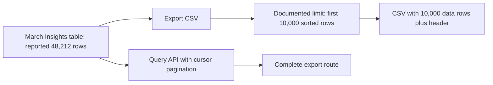

# 🟢 Triage Report: SUP-1003 — CSV export capped at 10,000 rows

**Ticket:** SUP-1003  
**Customer:** Contoso Learning (synthetic)  
**Issue Type:** How-to / documented limitation; initially bug-shaped  
**Product Area:** Insights table UI CSV export  
**Priority:** 🟢 P4  
**Plan Tier:** Unknown  
**SLA Target:** Not provided  
**Environment:** Beacon; browser, version, region and hosting unknown  
**Investigation Mode:** Read-only, offline fixtures

## 📖 Context for Reviewers

The customer needs all March rows for finance reconciliation. [UI CSV export](../mock-sources/docs/exports.md) downloads table results but has a documented size limit. The ticket reports 48,212 rows in the UI and exactly 10,000 data rows in the CSV. No SDK or browser details were supplied.

## Issue Summary

The customer asks whether the export is broken or a setting is missing. The reported count matches the documented UI export cap. The full dataset requires a different export route or smaller batches.

## Intake

ASSUMING: Beacon Insights CSV export, region and plan unknown, one customer report with broader scope unverified.
→ Correct me now or I proceed with these.

| Field | Value |
|---|---|
| Issue Type | Initially suspected truncation bug; assessed as documented limitation |
| Product Area | Insights UI CSV export |
| Timeframe | March dataset; year, onset and export date unspecified |
| Impact | Incomplete file for finance reconciliation; one customer report |
| Environment | Beacon; browser, version, region and plan unknown |
| Identifiers | SUP-1003 |
| Reproduction | Export March table; reported 48,212 UI rows versus 10,000 CSV rows plus header, always |
| Missing Context | Preferred full-export route; plan only if warehouse export is desired |
| First Investigation Paths | Export docs; exact-limit tracker match; recent truncation candidates |

## Evidence Gathered

| # | Source / Query | Finding | Status |
|---|---|---|---|
| E1 | tickets/003-csv-export-truncated.md | Customer reports 48,212 UI rows and 10,000 CSV data rows; P4 | ✅ Verified as ticket content; not independently reproduced |
| E2 | mock-sources/docs/exports.md, full read | UI export returns at most 10,000 rows in current sort order; dialog banner states limit. Full export uses Query API cursor pagination or plan-dependent warehouse export | ✅ Verified fixture documentation |
| E3 | mock-sources/issues/BEACON-097.md, full read | Exact cap is documented; API pagination or date-range batches advised. Open feature request, backlog, no committed date | ✅ Verified fixture tracker |
| E4 | mock-sources/issues/BEACON-160.md, full read | EU dashboard tiles intermittently show no data; direct insights show results | ✅ Verified; rejected as different symptom |
| E5 | mock-sources/issues/, four searches below | Only export-specific result is BEACON-097; metadata sweep covers five issues | ✅ Verified search results |
| E6 | Customer-specific export / project data | No independent row counts, banner observation or API result available | ❌ Unverified |

## 🐛 Known-Issue Search

Offline tracker: mock-sources/issues/. Searches executed with rg, not live network tools.

| # | Query type | Repo / tracker | Exact executed query | Best Candidate | Conclusion |
|---|---|---|---|---|---|
| 1 | Hybrid via synonyms | mock-sources/issues | `rg -n -i 'truncat\|limit\|cap\|missing\|partial\|export\|download' mock-sources/issues` | BEACON-097; unrelated Safari matches | Exact limit match |
| 2 | Lexical | mock-sources/issues | `rg -n -i 'CSV\|rows\|Insights\|pagination' mock-sources/issues` | BEACON-097 | Accepted |
| 3 | Exact surface | mock-sources/issues | `rg -n -F -e '10,000' -e '10000' -e '48,212' mock-sources/issues` | BEACON-097 | Accepted; no match for 48,212 |
| 4 | Recent metadata sweep | mock-sources/issues | `rg -n -e '^updated:' -e '^created:' -e '^#' mock-sources/issues` | BEACON-097 updated 2026-04-22; BEACON-160 updated 2026-05-02 | Compared all five records; newer issue has different symptom |

**Matching issue:** BEACON-097, accepted feature request for exports over 10,000 rows, corroborated by E2.

**Closest rejected candidate:** BEACON-160 concerns empty dashboard tiles, not a successful CSV capped at exactly 10,000 rows (E4). Safari delivery/identity matches in the broad search lack the export symptom and were not pursued.

**Search gaps:** Ticket omits onset date and March year, so recent metadata cannot establish temporal correlation. This is a fixture-only search, not a claim about a live tracker.

## 🗺️ How It Works (and Where It Breaks)

The export path imposes the documented limit; the displayed total need not equal the file size (E2).

## 🎯 Root-Cause Assessment

**Assessment:** The reported CSV size matches Beacon's documented UI export limit; the available evidence does not indicate a malfunction or a missing setting.

**Confidence:** Likely based on pattern match

**Reasoning:** E2 directly confirms the product limit, and E3 matches the exact reported threshold in E1. The customer-specific cause remains inferred because no export was inspected or reproduced (E6). The full known-issue matrix is complete for the available fixtures.

**Not explained:** Whether the customer saw the documented banner; independent accuracy of the 48,212-row total. No other symptom was reported.

## Recommended Next Action

1. 🔧 For a complete export, use the documented Query API route: `GET /api/v2/query` with cursor pagination (E2). Exact authentication, response format and cursor completion rules are not supplied by these fixtures; verify those before providing implementation instructions.
2. 🔧 Alternatively, narrow the date range and export batches below 10,000 rows (E3). Verify batch coverage and combined totals against the same filters; this verification is a proposed reconciliation check, not a documented product guarantee.
3. Ask which route the customer prefers. Check plan eligibility before suggesting scheduled warehouse export as available (E2).

### Reproduction (status: not yet run)

**Environment:** Beacon Insights; version, browser, region and plan unknown.  
**Preconditions:** Synthetic table with more than 10,000 rows, stable filters and sort order (assumed).

1. Open a March Insights table with more than 10,000 rows (source: ticket; synthetic setup assumed).
2. Choose Export CSV and inspect the export-dialog banner (source: docs).
3. Count data records separately from the header (source: ticket).

**Expected:** At most 10,000 data rows in current sort order (E2).  
**Actual:** Customer reports exactly 10,000 plus header, against 48,212 UI rows (E1).  
**Control:** Repeat with only the date range changed to yield fewer than 10,000 rows; expect no truncation from this cap (inferred from E2).  
**Frequency:** Always, according to ticket; number of runs unknown.

## Escalation Decision

**Decision:** No escalation needed at present.

**Reason:** Reported behavior matches documentation and an existing feature request (E2–E3). Customer confirmation remains outstanding.

**Suggested owner if escalated:** Exports / Query API engineering; actual team name unknown.  
**Follow-up cadence:** After the customer selects a route or reports a discrepancy; no promised timeline.

Escalate with sanitized counts and filter details if a below-limit export is incomplete or a paginated full export cannot retrieve all matching rows. No escalation has been sent.

## 🔎 Verify This Report

1. Open `mock-sources/docs/exports.md`: confirm the 10,000-row cap, current sort order and dialog banner.
2. Open `mock-sources/issues/BEACON-097.md`: confirm API pagination and smaller date-range batches; do not promise a delivery date.
3. Compare the ticket's reported counts against E2; treat these as reported rather than independently verified.
4. If using warehouse exports, verify the customer's plan eligibility; if using the API, obtain its detailed pagination documentation before supplying code.

## 💬 Draft Customer Response

Hi,

Thanks for the precise row counts. Beacon’s Insights CSV export is limited to 10,000 data rows, plus the header, in the table’s current sort order. The 48,212-row total can therefore exceed the CSV size; your result matches the documented limit.

For the full March list, use the Query API with cursor pagination, or narrow the date range and export in batches, keeping each batch below the limit. Scheduled warehouse exports are another option on plans that include them.

Would you prefer the API route or date-range batches? We can help you choose the next step for your finance reconciliation.

--- END OF CUSTOMER-FACING CONTENT ---

## 🔬 Evidence Pack (internal only)

✅ Pre-send spot check: all cited references verified.

### Engineer TL;DR

The documented UI cap exactly matches the reported CSV size. Customer-specific causation is likely, not independently confirmed. Provide the documented full-export alternatives; no engineering escalation is currently warranted.

### Claim-Source Map

| # | Claim | Source | Status |
|---|---|---|---|
| 1 | Ticket reports the two row counts | E1 | ✅ Verified as report |
| 2 | UI cap is 10,000, current sort order; banner documented | E2 | ✅ Verified |
| 3 | API cursor pagination is a full-export route | E2–E3 | ✅ Verified |
| 4 | Date-range batching is recommended | E3 | ✅ Verified |
| 5 | Warehouse exports depend on plan | E2 | ✅ Verified |
| 6 | Matching feature request is open without committed delivery date | E3 | ✅ Verified |
| 7 | Cap explains this customer's file size | E1–E3 | ⚠️ Inferred |
| 8 | Customer's actual export and total are independently correct | E6 | ❌ Unverified |

### Unknowns

- Export artifact, actual project state, banner visibility, plan, environment and onset date.
- API authentication and detailed cursor response shape; do not invent these.
- Confidence limited by lack of project data access. No browser repro or customer resource access was attempted.

### Confidence Score

**Overall:** Medium, 70% after cap.

- Verified claims: 6
- Inferred claims: 1
- Unverified claims: 1
- Arithmetic: (6 + 0.5) / 8 × 100 = 81.25%.
- Caps applied: plausible matching issue accepted but customer-level cause not independently verified → Medium (70%). No incomplete-search cap.

### Anti-hallucination and contradiction check

Claims mapped above to sources read this session. Documentation and the matching issue agree. No fix date, new setting, plan entitlement or unverified API shape is asserted. Recommended routes are documented; coverage verification is explicitly proposed. Recent metadata cannot be correlated to an unspecified onset date.

### Redaction confirmation

Redaction pass: 1 personal name omitted across the two output files; no tokens, private URLs, raw person properties or internal admin links included. Customer draft contains no fixture paths, tracker identifiers, raw queries or internal tools.
