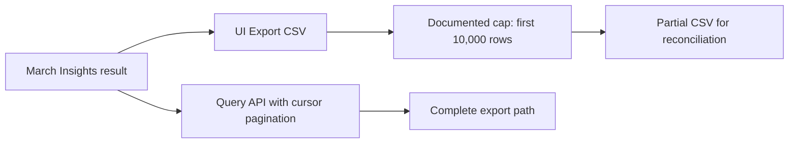

# 🟢 Triage Report: SUP-1003 — CSV export stops at 10,000 rows

**Ticket:** SUP-1003
**Customer:** [redacted organization]
**Issue Type:** How-to / Data; initially bug-shaped truncation
**Product Area:** Insights table UI CSV export
**Priority:** 🟢 P4
**Plan Tier / SLA:** Unknown / not provided
**Environment:** Beacon UI; browser, version, region and hosting unknown
**Investigation Mode:** Read-only, offline synthetic fixtures

## 📖 Context for Reviewers

The customer needs a complete March Insights table for finance reconciliation. The UI reports 48,212 rows, but CSV downloads contain 10,000 data rows plus a header. [Export documentation](../mock-sources/docs/exports.md) describes the UI limit and full-export alternatives. No SDK or backend integration is reported. [E1–E2]

## Issue Summary

The customer reports a repeatable 10,000-row cutoff despite a 48,212-row table total. The documented UI limit matches this symptom; the customer needs a different export route for the complete result. The observed file and account have not been independently inspected. [E1–E3]

## Intake

| Field | Value |
|---|---|
| Issue Type / Area | How-to / Data; Insights CSV export |
| Timeframe | March reporting period; year, onset and deployment correlation unknown |
| Impact | Finance reconciliation lacks the full list; wider blast radius unknown |
| Environment | UI export assumed; browser, version, region and plan unknown |
| Identifiers | SUP-1003; no project or request identifiers supplied |
| Reproduction | Export March Insights table; expected 48,212 rows, reported actual 10,000 plus header; reportedly always |
| Missing Context | Confirm UI export route if needed; plan eligibility only if choosing scheduled warehouse export |

## Evidence Gathered

| # | Source / Query | Finding | Status |
|---|---|---|---|
| E1 | `tickets/003-csv-export-truncated.md`, read | Customer reports 48,212 UI rows and 10,000 exported data rows; finance use case | ✅ Verified as ticket content; actual result not independently verified |
| E2 | [exports.md](../mock-sources/docs/exports.md), read | UI exports first 10,000 rows in current sort order; dialog banner states limit; full exports via cursor-paginated Query API or plan-dependent scheduled warehouse export | ✅ Verified documentation |
| E3 | [BEACON-097](../mock-sources/issues/BEACON-097.md), full-body read | Same limitation; full-export API or smaller date-range batches; open backlog feature request, no committed delivery date | ✅ Verified tracker content |
| E4 | Search matrix below; full-body reads of [BEACON-151](../mock-sources/issues/BEACON-151.md) and [BEACON-160](../mock-sources/issues/BEACON-160.md) | Newer issues concern webhook signatures and EU dashboard empty tiles, respectively; neither explains an exact CSV cutoff | ✅ Verified candidate scope; rejection inferred |
| E5 | `mock-sources/README.md`, read | Beacon is fictional; local fixtures substitute for live connected sources | ✅ Verified; no web research appropriate |

## 🐛 Known-Issue Search

All queries below were executed with `rg` against `mock-sources/issues`; no external repository was searched. Hybrid means the fixture-prescribed synonym/paraphrase search, not a semantic search service. [E4–E5]

| # | Query type | Repo / tracker | Exact executed command | Best Candidate | Conclusion |
|---|---|---|---|---|---|
| 1 | Hybrid | Local issue fixtures | `rg -n -i 'truncat\|cut.?off\|limit\|missing rows\|partial\|cap\|stops' mock-sources/issues` | BEACON-097 | Accepted: explicit Insights CSV cap; unrelated browser matches discarded |
| 2 | Lexical | Local issue fixtures | `rg -n -i 'CSV\|export\|rows' mock-sources/issues` | BEACON-097 | Accepted: same export surface and row count |
| 3 | Exact | Local issue fixtures | `rg -n -F -e '10,000' -e '10000' -e 'Insights' -e 'CSV' mock-sources/issues` | BEACON-097 | Accepted: exact 10,000-row limit |
| 4 | Recent | Local issue fixtures | `rg -n 'updated:\|created:\|^#\|export\|CSV' mock-sources/issues` | BEACON-097; BEACON-151; BEACON-160 | Compared front-matter dates: export candidate updated 2026-04-22; newer inspected issues updated 2026-05-01 and 2026-05-02 concern other features |

**Matching issue:** BEACON-097 is a feature request, not a confirmed export defect. Its body was inspected and agrees with export docs. [E2–E3]

**Closest rejected candidates:** BEACON-160 involves empty EU dashboard tiles, not CSV truncation; BEACON-151 involves webhook signature failures, not exports. [E4]

**Search gaps:** Ticket onset and March year are unknown, limiting temporal correlation. Fixtures provide no live production coverage or customer-account evidence. No claim is made about issues outside the fixture tracker. [E1, E5]

## 🗺️ How It Works (and Where It Breaks)

The documented UI export applies a cap after the table result is produced. This creates the reported mismatch without demonstrating lost stored data. The API path uses cursor pagination for full exports; no pagination response schema was supplied. [E1–E3]

## 🎯 Root-Cause Assessment

**Assessment:** The documented UI export limit likely accounts for the exact 10,000-row cutoff; the matching tracker entry requests expanding that limit. [E1–E3]

**Confidence:** Likely based on pattern match

**Reasoning:** Documentation directly confirms the limit and sort-order behavior; the reported count matches exactly. The customer's route, file and account have not been independently checked. This is a documented limitation if the assumed UI route is confirmed. The matching feature request remains relevant; confidence is capped at Medium (70%) because the customer-specific explanation is not directly proven. [E1–E3]

**Not explained:** Whether the 48,212-row UI total is accurate, whether the customer saw the limit banner, and whether the API result will match that total under identical filters. [E1–E2]

## Recommended Next Action

1. 🔧 For a complete export, use the documented Query API with cursor pagination (`GET /api/v2/query`, `cursor` parameter). Follow the API documentation for implementation; the fixture does not specify response fields or cursor termination behavior. [E2]
2. 🔧 For a UI-only approach, narrow the date range and export batches. Verify each result is within the 10,000-row limit and reconcile the combined count using consistent filters and non-overlapping ranges. Batching is documented; the count and boundary checks are verification advice. [E2–E3]
3. Scheduled warehouse export is an alternative only on eligible plans; confirm entitlement before offering it as available. Escalate if a verified complete-export route also truncates, or if UI exports contradict the documented cap. [E2; proposed escalation condition]

### Reproduction (status: not yet run)

**Environment:** Beacon UI; browser, version, region and plan unknown.
**Preconditions:** Synthetic Insights data with more than 10,000 matching rows (assumed).

1. Open an Insights table for March (source: ticket).
2. Note the result count and current sort order, then select Export CSV (source: ticket and docs; exact route assumed).
3. Count data rows excluding the header (source: ticket).

**Expected:** UI CSV contains at most the first 10,000 rows in current sort order, with a dialog limit banner. [E2]
**Actual:** Customer reports 10,000 data rows versus a 48,212-row total. [E1]
**Control:** Change only the date range to produce fewer than 10,000 rows; expect no loss from this cap (inference from E2).
**Frequency:** Reportedly always; no run performed in this investigation.

## Escalation Decision

**Decision:** No engineering escalation needed at present.
**Reason:** Documentation and the fully inspected feature request explain the reported UI cutoff; no contrary evidence is supplied. [E1–E3]
**Suggested owner if escalated:** Exports / Query API component; actual team unknown.
**Follow-up cadence:** When the customer reports the alternative-export outcome; no timeline promised.

## 🔎 Verify This Report

1. Open [exports.md](../mock-sources/docs/exports.md): verify the 10,000-row cap, sort order and banner.
2. Open [BEACON-097](../mock-sources/issues/BEACON-097.md): verify open feature-request status, batch/API guidance and no committed delivery date.
3. Confirm the customer used UI Export CSV; if a different route was used, reassess the root cause.
4. For the chosen export route, compare the complete data-row count with the same table filters; do not treat a capped file as complete.

## 💬 Draft Customer Response

Thanks for including both row counts. Beacon's Insights CSV export from the UI is limited to the first 10,000 rows in the table's current sort order. Your reported cutoff matches that documented limit.

For the full March list, use the Query API with cursor pagination. Alternatively, narrow the date range and export smaller batches, keeping each result within 10,000 rows. For reconciliation, use non-overlapping ranges and check the combined row count against the table total with the same filters.

If you were already exporting through the Query API rather than the UI, please let us know so we can investigate that separately.

--- END OF CUSTOMER-FACING CONTENT ---

## 🔬 Evidence Pack (internal only)

✅ Pre-send spot check: all cited references verified.

### Engineer TL;DR

Documentation confirms a UI cap; customer attribution remains a pattern match. BEACON-097 tracks expansion as an open feature request. Recommend paginated API export or smaller UI batches; do not claim account eligibility for warehouse exports.

### Claim-Source Map

| # | Claim | Source | Status |
|---|---|---|---|
| 1 | Customer reports 48,212 versus 10,000 rows | E1 | Verified as report only |
| 2 | UI cap, first rows in current sort order, banner | E2 | Verified |
| 3 | Cursor-paginated API supports full exports | E2 | Verified |
| 4 | Warehouse export availability depends on plan | E2 | Verified |
| 5 | Feature request open; no delivery date committed | E3 | Verified |
| 6 | Smaller date-range batching is documented guidance | E3 | Verified |
| 7 | UI cap caused this customer's observed cutoff | E1–E3 | Inferred |
| 8 | Inspected newer candidates do not explain CSV cutoff | E4 | Inferred |

### Unknowns

- Actual customer export route, file contents and account state; no project-data connector used. Confidence limited by lack of project data access.
- Browser, product version, region, plan, March year and symptom onset.
- Complete API pagination schema and warehouse plan entitlement; do not invent either.

### Anti-hallucination Review

Claims extracted and mapped above. Docs and issue body agree; no contradiction found in inspected sources. No code execution, production verification or live-version claim is made. Proposed reconciliation checks are advice, not claimed product capabilities. Issue status is fixture status as read this session, not a live service guarantee.

### Confidence Score

**Overall:** Medium, 70% after cap.

- Verified claims: 6; inferred claims: 2; unverified scored claims: 0.
- Arithmetic: `(6 + 2 × 0.5) / 8 × 100 = 87.5%` before cap.
- Caps applied: relevant candidate/customer-specific cause not directly verified → Medium, 70%.
- Search gate complete within fixture scope; unknowns remain explicitly excluded from asserted facts.

### Redaction confirmation

Redaction pass: 2 source identity omissions (organization and reporter name) applied across both output files. No tokens, private URLs, raw person properties, internal admin links or customer data included. Customer response contains no internal paths, tracker references, raw queries or emojis.
