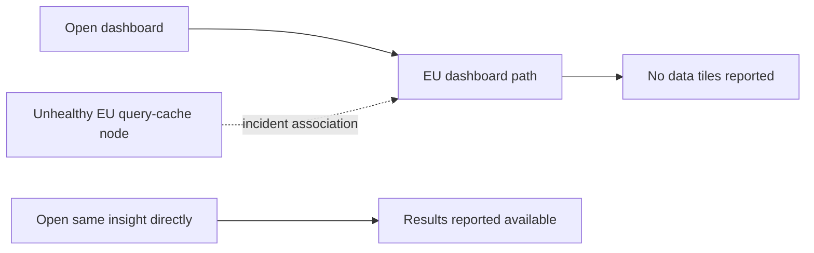

# 🔴 Triage Report: SUP-1004 — Whole-team dashboards blank

**Ticket:** SUP-1004
**Customer:** Customer organization omitted from saved output
**Issue Type:** Bug / Data availability
**Product Area:** Dashboard tile rendering / query results
**Priority:** 🔴 P1
**Plan Tier:** Unknown
**SLA Target:** Not supplied
**Environment:** Beacon; browser, region, SDK and hosting details unknown
**Investigation Mode:** Read-only, offline synthetic fixtures; reviewed 2026-10-07

## 📖 Context for Reviewers

The customer needs dashboard results for a board meeting at noon on the ticket date. Every dashboard tile reportedly displays “No data,” affecting the whole team. The available fixtures describe an EU dashboard incident, but no dedicated dashboard documentation or customer project access is available. Customer stack is unknown.

## Issue Summary

At 08:40 UTC on 2026-05-02 the customer reported all dashboards blank that morning, with every tile showing “No data.” Whole-team impact and the meeting deadline make this P1. A contemporaneous EU incident is a strong candidate, but customer affiliation with that incident remains unverified.

## Intake

ASSUMING: Beacon dashboards, region and plan unknown, whole-team impact as reported.
→ Correct me now or I proceed with these.

| Field | Value |
|---|---|
| Issue Type / Product Area | Bug / dashboard tiles |
| Timeframe | Morning of 2026-05-02; ticket sent 08:40 UTC. Present-day persistence unknown. |
| Impact | Whole team reportedly affected; board meeting at noon, timezone unspecified. Dashboard unavailability reported, total product outage not established. |
| Environment | Browser, OS, SDK/version, project region, plan and hosting unknown. |
| Identifiers | SUP-1004; exact visible copy: “No data.” No project ID supplied. |
| Reproduction | Open dashboards; all tiles reportedly blank. Independent reproduction not run; frequency/count unspecified. |
| Missing Context | Project ID and region; whether one affected insight opened directly returns results with identical date range and filters; whether impact persists now. |
| First investigation paths | Incident history, dashboard tracker search matrix, available docs/releases. |

## Evidence Gathered

| # | Source / Query | Finding | Status |
|---|---|---|---|
| E1 | tickets/004-dashboards-blank.md, full read | P1 ticket at 2026-05-02 08:40 UTC reports whole-team blank dashboards, every tile “No data,” noon meeting. | ✅ Verified ticket content; customer observation not independently verified |
| E2 | mock-sources/issues/BEACON-160.md, full read | Open issue, created/updated May 2: some EU projects show “No data” tiles while direct insights return results; reports began about 08:10 UTC; query-cache node under investigation; no US reports recorded. | ✅ Verified fixture |
| E3 | mock-sources/status/incidents.md, full read | May 2 EU incident: 08:10 investigating; 09:05 unhealthy query-cache node identified, mitigation in progress; fixture status Monitoring; direct insights unaffected and US unaffected in stated scope. | ✅ Verified fixture; historical record, not live status |
| E4 | mock-sources/issues/BEACON-142.md and BEACON-118.md, full reads | Safari candidates concern final-page event loss and anonymous identity continuity respectively, not dashboard rendering. BEACON-142 includes a May 4 update after this ticket. | ✅ Verified fixture scope; rejected as leading match |
| E5 | mock-sources/issues/BEACON-151.md and BEACON-097.md, full reads | Webhook signature failure and CSV row-limit request concern different product areas. | ✅ Verified fixture scope; rejected |
| E6 | Docs/releases search: rg -n -i 'dashboard\|no data\|query\|outage' mock-sources/docs mock-sources/releases | Only export Query API guidance matched; no dashboard troubleshooting or dashboard fix release found in searched fixtures. | 🔍 Searched, no relevant dashboard guidance |
| E7 | mock-sources/status/incidents.md | April 11 all-region ingestion delay lasted 13:00–13:40, resolved; wrong timeframe for May 2 report. | ✅ Verified fixture; rejected |
| E8 | Available investigation inputs | No project ID, project-data access, customer logs, browser URL or independently executed reproduction. | ❌ Customer-specific cause unverified |

## 🐛 Known-Issue Search

All tracker searches used the complete local tracker mock-sources/issues/. Offline “hybrid” means regex synonym/paraphrase discovery, not semantic ranking.

| # | Query type | Repo / tracker | Executed query | Best Candidate | Conclusion |
|---|---|---|---|---|---|
| 1 | Hybrid | mock-sources/issues/ | rg -n -i 'blank\|empty\|missing\|no results\|outage\|dashboard\|tile' mock-sources/issues | BEACON-160; BEACON-142 | Accept 160 as plausible; 142 is event-delivery scope |
| 2 | Lexical | mock-sources/issues/ | rg -n -i 'dashboard\|query\|cache\|data' mock-sources/issues | BEACON-160; BEACON-097 | Accept 160 as plausible; 097 is export scope |
| 3 | Exact surface | mock-sources/issues/ | rg -n -F 'No data' mock-sources/issues | BEACON-160 | Exact visible message match |
| 4 | Recent | mock-sources/issues/ | rg -n 'updated:\|created:\|dashboard\|blank' mock-sources/issues | BEACON-160, May 2 | Dates match incident day. Compared all five issues' dates; May 4 update to 142 is retrospective evidence, not contemporaneous knowledge. |

**Matching issue / incident:** mock-sources/issues/BEACON-160.md and mock-sources/status/incidents.md are accepted as a plausible incident association, not proof of this customer's cause.

**Closest rejected candidates:** BEACON-142: Safari final-navigation event loss, no browser/version evidence and different symptom scope. BEACON-118: identity counts, explicitly not delivery. BEACON-097: CSV limit. BEACON-151: webhook verification. April 11 ingestion incident: wrong date and resolved.

**Search gaps:** Complete search matrix within supplied offline tracker. No live tracker, current incident status, source-code repository or project data available; no web search for fictional Beacon.

## 🗺️ How It Works (and Where It Breaks)

The diagram shows the fixture-supported contrast, not a verified internal architecture (E2–E3).

The status fixture identifies an unhealthy EU query-cache node; it does not document the exact failure mechanism or prove that stored customer data is intact.

## 🎯 Root-Cause Assessment

**Assessment:** The May 2 EU dashboard incident is the leading explanation, conditional on the customer's project being in the affected scope. An unhealthy query-cache node was identified in the incident record; customer-specific attribution is not established.

**Confidence:** Likely based on pattern match

**Reasoning:** Exact tile message, dashboard scope and timing match E1–E3: incident reports start 30 minutes before the ticket. The 09:05 identification is later evidence and must not be represented as known at 08:40. E8 leaves region, direct-insight behavior and project involvement unverified. A plausible incident association remains unconfirmed, so overall confidence is capped at Medium (70%).

**Not explained:** Whether this customer is in EU; why every dashboard/team member is affected when the issue describes some projects and intermittent tiles; whether direct insights work; whether the customer recovered; whether any ingestion/storage issue also exists. No data-loss conclusion is supported.

## Recommended Next Action

1. 🚨 Have the operator route this P1 brief immediately to the dashboard/query-cache incident owner. Confirm affected project membership, mitigation outcome and current status; do not wait for all customer details before routing urgent impact.
2. Ask for project ID and region, and a single direct-insight comparison with unchanged date range and filters.
3. 🔧 If the direct insight returns results, offer it as conditional temporary access for the meeting. This is grounded in E2–E3, not a guaranteed workaround. If it also shows no data or the project is outside EU, engineering must investigate beyond the known incident.
4. Obtain a recovery check before telling the customer the issue is resolved. Do not change settings, deploy SDK updates or claim a fix ETA based on these fixtures.

### Reproduction (status: not yet run)

**Environment:** Beacon project; customer browser, region and plan unknown.
**Preconditions:** A synthetic test project in the incident's affected scope with an insight expected to contain results; engineer must verify these conditions.

1. Open an affected dashboard (source: ticket).
2. Record the tile result, date range and filters (source: assumed diagnostic step).
3. Open the same insight directly, retaining date range and filters (source: issue/status comparison).

**Expected:** Dashboard presents the insight's results when data exists (inferred from E2 contrast; dedicated dashboard docs unavailable).
**Actual:** Customer reports every tile “No data” (E1), not independently reproduced.
**Control:** Same insight, date range and filters, with only entry path changed from dashboard to direct insight; incident fixtures predict results on the direct path (E2–E3).
**Frequency:** Whole-team/all-tiles report; counts and repeated-run frequency unknown.

## Escalation Decision

**Decision:** Escalate to engineering.
**Reason:** P1 whole-team dashboard unavailability and a plausible active-at-ticket-time product incident require customer-specific verification.
**Suggested owner:** Dashboard/query-cache incident responder; exact team unknown.
**Follow-up cadence:** Operator should obtain current incident status immediately and agree the next customer update time; no SLA or ETA is supplied.
**Delivery status:** Brief prepared below; nothing sent, filed or changed in any external system.

### Escalation Brief

**Ticket:** SUP-1004  
**Customer Impact:** Whole team cannot use dashboard tiles before noon meeting, per customer report.  
**Severity:** Critical / P1  
**Suggested Owner:** Dashboard/query-cache incident responder  
**Filed by support:** Not filed; draft only  
**Date:** 2026-10-07 review of 2026-05-02 ticket

**Summary:** Blank dashboard tiles match BEACON-160 and the May 2 EU incident. Customer region and incident membership are unknown; support cannot confirm cause or recovery without project evidence.

**Customer Impact:** One reporting organization; all team members according to ticket; wider affected customer count unknown. First seen morning May 2, reported 08:40 UTC. Sudden onset reported, no deploy correlation. Dashboard unavailable, broader production outage unknown. Conditional direct-insight access is the only fixture-supported mitigation.

**Reproduction:** Use the unrun three-step reproduction above unchanged. Smallest missing artifacts: project ID/region and same-insight direct-path result.

**Expected Behavior:** Dashboard shows results for an insight with data.
**Actual Behavior:** All tiles reportedly say “No data.”
**Evidence:** E1 customer report; E2 matching open issue; E3 historical incident; E8 customer-specific verification gap.
**What Support Already Tried:** Read-only full tracker matrix, five candidate bodies, status history and docs/releases search. No customer-side operations or reproduction performed.
**Closest Known Issues:** BEACON-160 open, strong symptom/time match but conditional region; BEACON-142 closed in fixture, rejected as Safari navigation event-loss scope.
**Specific Ask:** Confirm project scope against the May 2 EU incident; inspect dashboard versus direct-insight request outcomes; confirm whether the unhealthy query-cache node explains this project and whether mitigation restored results. If region/direct-path results disagree, investigate a separate P1 cause.
**Workaround:** Direct insight with identical date range/filters only if it actually returns results; no guaranteed restoration or fix time.

## 🔎 Verify This Report

1. Read tickets/004-dashboards-blank.md: confirm 08:40 UTC, “No data,” whole-team scope and noon deadline.
2. Read mock-sources/issues/BEACON-160.md: verify May 2 08:10 onset, EU scope and dashboard/direct-insight contrast.
3. Read mock-sources/status/incidents.md: verify 09:05 identification is later than ticket and Monitoring does not establish present recovery.
4. Obtain project region and compare one dashboard tile with its direct insight using identical date range/filters; no comparison has been run here.
5. Have the incident owner verify current customer impact before communicating resolution.

## 💬 Draft Customer Response

We understand that the whole team cannot use dashboards ahead of your noon board meeting.

A reported EU-region dashboard incident began at 08:10 UTC on May 2 and matches the “No data” message you described. We have not yet confirmed whether your project is affected by that incident.

Please confirm your project ID and region, and try opening one affected insight directly with the same date range and filters. Direct insights were reported as unaffected in that incident; if yours returns results, it may provide temporary access for the meeting.

This needs urgent engineering review. We cannot yet confirm recovery or a fix time.

--- END OF CUSTOMER-FACING CONTENT ---

## 🔬 Evidence Pack (internal only)

Pre-send spot check: all cited references verified.
Redaction pass: 1 replacement made across outputs (customer organization omitted from report); no secrets, raw person properties or private links included. Customer draft contains no internal tracker IDs, tool names or fixture paths.

### Engineer TL;DR

Strong symptom/time match to May 2 EU dashboard incident. The unhealthy node is confirmed in the historical incident fixture, not confirmed as this project's cause. Route P1 to the incident responder and obtain region plus direct-insight comparison. No external escalation or fix has been performed.

### Claim-Source Map

| # | Claim | Source | Status |
|---|---|---|---|
| C1 | Ticket reports whole-team “No data” at 08:40 with noon meeting | E1 | Verified as report |
| C2 | Matching issue describes EU onset 08:10 and direct insights returning results | E2 | Verified fixture |
| C3 | Later status identifies unhealthy node and records Monitoring | E3 | Verified fixture |
| C4 | This customer likely belongs to that incident | E1–E3, E8 | Inferred |
| C5 | Direct insight may offer this customer temporary access | E2–E3, E8 | Inferred |
| C6 | Region, project cause and present recovery are not verified | E1, E8 | Verified evidence gap |

### Unknowns

Project ID, region, browser/OS, plan, filters/date range, direct-insight result, impact duration, mitigation outcome, current status and exact failure mechanism. Confidence limited by lack of project data access.

### Confidence Score

**Overall:** Medium, 70% after cap.
- Verified claims: 4.
- Inferred claims: 2.
- Unverified claims: 0 in scored claims; customer-specific attribution is intentionally only inferred.
- Arithmetic: (4 + 2 × 0.5) / 6 × 100 = 83.3%.
- Caps applied: Plausible candidate association not confirmed → Medium, maximum 70%.
- Root assessment remains Likely, not Confirmed; scoring verified fixture statements does not prove customer attribution.

### Anti-hallucination protocol

Claim extraction/source mapping completed above. No API/version/config fix claims used. Contradiction review: intermittent/some-project issue scope versus customer's all-tiles scope is retained as a gap. Temporal review: historical May 2 ticket and later 09:05 update kept distinct; present-day status not inferred. Unverified-claim review: no guarantee of data integrity, customer membership, recovery or ETA. Draft escalation phrasing says review is needed, not that a message was sent.

