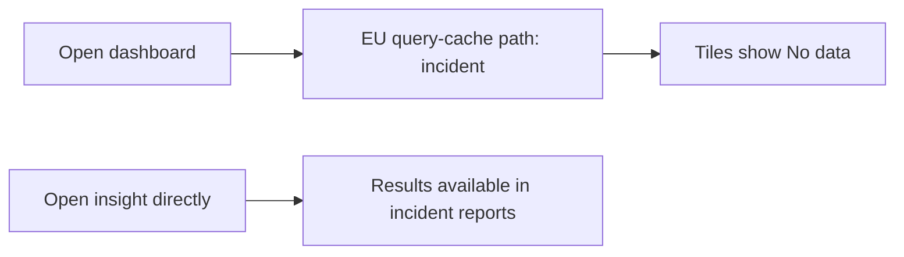

# 🔴 Triage Report: SUP-1004 — Team-wide blank dashboards

**Ticket:** SUP-1004  
**Customer:** [organization withheld]  
**Issue Type:** Bug  
**Product Area:** Dashboard tile loading  
**Priority:** 🔴 P1  
**Plan Tier / SLA Target:** Unknown / not supplied  
**Environment:** Beacon; region, browser, SDK and hosting unknown  
**Investigation Mode:** Read-only, offline synthetic fixtures; investigated 2026-10-07

## 📖 Context for Reviewers

The customer needs dashboards for a board meeting at noon on the ticket date. They report that every tile shows “No data” across the whole team [1]. Beacon dashboards display insights; the incident record distinguishes dashboard loading from opening insights directly [3]. Dashboard-specific docs and the customer's stack are not supplied.

## Issue Summary

The customer reported team-wide blank dashboards at 08:40 UTC on May 2, 2026 [1]. An EU incident began at 08:10 that day with the same visible message [2,3]. The customer's region and direct-insight behavior remain unverified; no fix was performed.

## Intake

| Field | Value |
|---|---|
| Issue Type / Product Area | Bug / dashboard tile loading |
| Timeframe | Morning of 2026-05-02; ticket sent 08:40 UTC; ongoing at submission, current state unknown |
| Impact | Whole team, all dashboards per customer; board meeting at noon, timezone unspecified |
| Environment | Region, plan, browser, OS, SDK/version and hosting unknown |
| Identifiers | SUP-1004; no project, dashboard or request identifiers supplied |
| Reproduction | Viewing dashboards yields “No data” on every tile, per customer; no independent run |
| Missing Context | Project region and safe project ID; whether one corresponding insight opens directly; whether issue persists |

## Evidence Gathered

| # | Source / Query | Finding | Status |
|---|---|---|---|
| 1 | [Ticket](../tickets/004-dashboards-blank.md) | P1; team-wide blank tiles at 08:40 UTC May 2; noon deadline | ✅ Verified as customer report, not independently reproduced |
| 2 | [BEACON-160](../mock-sources/issues/BEACON-160.md), full body | Open EU dashboard issue; “No data” from ~08:10 May 2; direct insights work; query-cache investigation | ✅ Verified fixture contents |
| 3 | [Incident history](../mock-sources/status/incidents.md), full body | EU incident at 08:10; unhealthy query-cache node identified 09:05; mitigation in progress; recorded status Monitoring; US unaffected | ✅ Verified historical fixture contents |
| 4 | Full bodies: [BEACON-097](../mock-sources/issues/BEACON-097.md), [BEACON-142](../mock-sources/issues/BEACON-142.md) | Export cap and Safari navigation event loss are different symptoms | ✅ Verified; rejected as leading explanations |
| 5 | Full bodies: [BEACON-118](../mock-sources/issues/BEACON-118.md), [BEACON-151](../mock-sources/issues/BEACON-151.md) | Identity continuity and webhook signature issues do not match dashboard loading | ✅ Verified; rejected as leading explanations |
| 6 | `rg -n -i 'dashboard|query|no data|incident|cache' mock-sources/docs mock-sources/releases` | Only export Query API guidance matched; no dashboard recovery guidance returned | 🔍 Searched, no relevant guidance |
| 7 | Customer-to-incident correlation [1–3] | Same symptom/date and close timing suggest incident association, conditional on EU region | ⚠️ Inferred |
| 8 | Project telemetry / live status | No project data or live Beacon connectors available in offline demo | ❌ Unverified — tool unavailable; current recovery and customer scope unknown |

## 🐛 Known-Issue Search

Offline synonym search substitutes for hybrid discovery, as prescribed for these fixtures. Entire tracker searched; no real repository or web search applies to fictional Beacon.

| # | Query type | Repo / tracker | Exact executed query | Best Candidate | Conclusion |
|---|---|---|---|---|---|
| 1 | Hybrid | mock-sources/issues | `rg -n -i 'blank|empty|no data|outage|unavailable|tiles|dashboard|query' mock-sources/issues` | BEACON-160; BEACON-097 | 160 accepted as plausible; 097 rejected |
| 2 | Lexical | mock-sources/issues | `rg -n -i 'dashboard|query|region|cache' mock-sources/issues` | BEACON-160 | Strong surface match; region not confirmed |
| 3 | Exact | mock-sources/issues | `rg -n -F 'No data' mock-sources/issues` | BEACON-160 | Exact UI message match |
| 4 | Recent | mock-sources/issues | `rg -n '^(updated:|created:|status:)|dashboard|query' mock-sources/issues` | BEACON-160 | Created/updated May 2, same date as ticket |

**Accepted candidate:** BEACON-160 is open in the fixture; its intermittent EU symptoms plausibly match, but the customer reports every tile affected and region is unknown [1,2].

**Closest rejected candidates:** BEACON-097 concerns CSV limits, not blank dashboards; BEACON-142 concerns Safari-only unload events; BEACON-118 concerns anonymous identity; BEACON-151 concerns webhook authentication [4,5]. All full bodies inspected. BEACON-142's May 4 update postdates the ticket and is retrospective evidence, not information available at 08:40 May 2.

**Search gaps:** No customer telemetry, dashboard-specific docs or live recovery status. All four offline search modes completed; coverage is limited to the supplied tracker fixtures.

## 🗺️ How It Works (and Where It Breaks)

This is a conceptual incident model, not a source-code trace [2,3]. Customer-specific association is unconfirmed.

## 🎯 Root-Cause Assessment

**Assessment:** The May 2 EU dashboard incident is the leading explanation. The incident record identifies an unhealthy query-cache node, but it does not prove that this customer's project was affected [1–3,7,8].

**Confidence:** Likely based on pattern match

**Reasoning:** Exact UI message and same-morning timing support a strong match. Region, project membership and direct-insight results are missing. The 09:05 identification postdates the 08:40 ticket, and “Monitoring” is historical fixture state, not a current recovery guarantee. Confidence is limited by lack of project data access; the plausible candidate cap is Medium (70%).

**Not explained:** Whether a regional intermittent incident accounts for every tile across the whole team; whether the customer is in EU; whether direct insights work or data is missing elsewhere. No basis to conclude data loss or its absence for this customer.

## Recommended Next Action

1. 🚨 Route this P1 packet to the dashboard/query-cache incident owner for customer correlation and current mitigation verification. Escalation is recommended, not sent.
2. 🔧 Ask the customer to open one affected insight directly; results there would offer a temporary way to view figures, as reported in the incident [2,3]. Do not guarantee this succeeds for their project.
3. Obtain project region and a safe project ID plus whether the problem persists. If non-EU or direct insights also fail, investigate as a separate P1 rather than assuming BEACON-160.

### Reproduction (status: not yet run)

**Environment:** Beacon; region/browser/version unknown.  
**Preconditions:** Access to an affected dashboard; existing data expected by the customer [1].

1. View an affected dashboard (source: ticket; exact navigation not supplied).
2. Observe tile output (source: ticket reports “No data”; not independently run).
3. Open the same insight directly with the same filters and date range (source: incident [2,3]; matching filters are an assumed control).

**Expected:** Dashboard shows the expected figures, per customer expectation [1].  
**Actual:** Every tile says “No data,” per customer [1].  
**Control:** Change only the viewing surface to direct insight. Incident records report results there; customer outcome unknown [2,3].  
**Frequency:** Team-wide and all tiles per report; repeat counts unknown.

## Escalation Decision

**Decision:** Escalate to engineering.  
**Reason:** P1 team-wide impact and a plausible regional incident cannot be resolved or confirmed with fixtures alone [1–3,8].  
**Suggested owner if escalated:** Dashboard/query-cache incident owner; exact team unknown.  
**Follow-up cadence:** Operator should confirm the next update time with the incident owner immediately; no SLA or recovery deadline established.  
**Attached brief:** [Engineering escalation brief](20261007-000000-SUP-1004-escalation.md). No external escalation performed.

## 🔎 Verify This Report

1. Open [the ticket](../tickets/004-dashboards-blank.md): verify 08:40 UTC May 2, whole-team impact and “No data.”
2. Open [BEACON-160](../mock-sources/issues/BEACON-160.md): verify EU scope, ~08:10 onset and direct-insight distinction.
3. Open [incident history](../mock-sources/status/incidents.md): verify 09:05 identification and historical Monitoring state; do not treat it as live recovery.
4. Obtain customer region/project ID and compare one tile with the same insight directly. Engineering must check customer incident membership and present status before confirming the cause.

## 💬 Draft Customer Response

I understand the whole team is seeing blank dashboards ahead of your board meeting. A reported EU dashboard incident on May 2 matches the “No data” message and timing, but we still need to confirm whether your project is affected.

Please try opening one affected insight directly. Direct insights were reported to work during that incident and may let you view the figures while dashboard loading is checked. Could you share your project region and project ID, whether that insight shows results, and whether the dashboards are still blank?

This warrants urgent engineering review to confirm the connection and recovery status. We cannot yet confirm a restoration time.

--- END OF CUSTOMER-FACING CONTENT ---

## 🔬 Evidence Pack (internal only)

Pre-send spot check: all cited references verified.

### Engineer TL;DR

Likely BEACON-160/May 2 EU cache incident, not customer-confirmed. Check region and incident membership; use direct insight comparison; confirm present status. No production action or external communication occurred.

### Claim-Source Map

| # | Claim | Source (row #) | Status |
|---|---|---|---|
| 1 | Customer reports team-wide blank tiles at 08:40 | 1 | Verified as report |
| 2 | EU issue has exact message and ~08:10 onset | 2 | Verified |
| 3 | Incident identifies unhealthy cache node at 09:05 | 3 | Verified |
| 4 | Direct insights work in incident reports | 2,3 | Verified, not customer-confirmed |
| 5 | Other tracker candidates address different symptoms | 4,5 | Verified |
| 6 | This customer likely shares the incident | 7 | Inferred |
| 7 | This customer's recovery/current scope | 8 | Unverified |

**Contradiction check:** Issue says intermittent/some EU projects; ticket says all dashboards/whole team. This is a scope uncertainty, not proof of the same cause. Issue investigating versus incident Monitoring reflects different fixture snapshots; no resolution inferred. No stale version or feature claim used as a remedy.

### Unknowns

- Region, project ID, direct-insight outcome, current persistence and incident membership.
- Exact onset, browser/version, affected dashboard IDs, meeting timezone and SLA.
- Customer data integrity; no telemetry was inspected.

### Confidence Score

**Overall:** Medium, 70% after cap.

- Verified claims: 5
- Inferred claims: 1
- Unverified claims: 1
- Arithmetic: (5 + 0.5) / 7 × 100 = 78.6%.
- Caps applied: plausible matching issue not ruled out → Medium (70%). Customer-specific cause unconfirmed; full offline gate completed.

### Redaction confirmation

- Redaction pass: 1 organization-name omission across 3 generated files; no tokens, personal properties, private URLs or admin links retained. Customer draft contains no internal tools, raw queries, private links or emojis.
