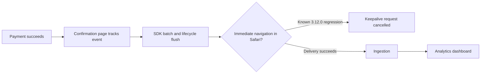

# 🟠 Triage Report: SUP-1001 — Safari checkout events missing

**Ticket:** SUP-1001  
**Customer:** Acme Analytics (synthetic fixture)  
**Issue Type:** Bug  
**Product Area:** Browser SDK event delivery during navigation  
**Priority:** 🟠 P2  
**Plan / SLA:** Unknown / not provided  
**Investigation Mode:** Read-only, offline Beacon fixtures inspected this session  
**Investigation date:** 2026-10-07; the reported onset is historical, not yesterday relative to this investigation.

## 📖 Context for Reviewers

The customer wants successful checkouts counted in analytics. The [browser SDK delivery guide](../mock-sources/docs/browser-sdk.md) describes batching and unload-safe event delivery. Payment confirmation still appears, but about half of Safari completion events are reportedly missing. The app uses Next.js and browser SDK 3.12.0 in the US region; Chrome reportedly works normally (E1).

## Issue Summary

The reported regression began around 2026-04-28 14:00 UTC after frontend deployment `2026.04.28.2`. A known Safari navigation regression matches the browser versions, SDK version and approximate loss rate. Whether this checkout event is immediately followed by navigation remains unverified.

## Intake

ASSUMING: Next.js with Beacon browser SDK v3.12.0, US region, plan unknown, multiple Safari users affected.
→ Correct me now or I proceed with these.

| Field | Value |
|---|---|
| Issue Type / Product Area | Bug / browser SDK navigation-time delivery |
| Timeframe | Reported onset 2026-04-28 14:00 UTC; continuing at ticket time; current state unknown |
| Impact | About half of Safari users' checkout completion events reportedly missing; payments succeed; one organization reported |
| Environment | Safari 17/18, Next.js, browser SDK 3.12.0, US; OS, hosting, plan and Next.js version unknown |
| Identifiers | SUP-1001; `checkout_completed`; frontend `2026.04.28.2` |
| Reproduction | Confirmation page tracks event after payment; expected dashboard event, actual absent for some Safari users; not reproduced |
| Missing Context | Event/navigation sequence, deployed runtime SDK version, sanitized network trace; current recurrence |

## Evidence Gathered

| # | Source / Query | Finding | Status |
|---|---|---|---|
| E1 | [Ticket](../tickets/001-safari-checkout-events.md) | Browser/version/impact/onset details above are customer-reported, not independently measured | ✅ Verified ticket content |
| E2 | [Delivery docs](../mock-sources/docs/browser-sdk.md) | Flush every 3 seconds, at 20 events or page hidden; per-call beacon transport or awaited flush before navigation documented | ✅ Verified fixture |
| E3 | [BEACON-142](../mock-sources/issues/BEACON-142.md), full body | SDK 3.12.0 Safari 17/18 regression near navigation; 30–60% loss; cancelled keepalive requests; closed, fixed in 3.12.2 | ✅ Verified issue content; customer match inferred |
| E4 | [Release notes](../mock-sources/releases/browser-sdk.md) | 3.12.0 released Apr 24 with unload transport/lifecycle changes; 3.12.2 May 4 restores sendBeacon in WebKit; 3.12.1 fixes identify types only | ✅ Verified fixture |
| E5 | [BEACON-118](../mock-sources/issues/BEACON-118.md), full body | Identity continuity issue; events still received | ✅ Verified rejected candidate |
| E6 | [BEACON-160](../mock-sources/issues/BEACON-160.md) and [incidents](../mock-sources/status/incidents.md) | Dashboard incident begins May 2 in EU; US unaffected in fixture. Apr 11 ingestion delay predates reported onset | ✅ Verified scope/time mismatch |
| E7 | Four issue-search commands listed below; all five issue bodies inspected | Search matrix complete within the local tracker; BEACON-151 concerns webhook signatures and BEACON-097 CSV exports | ✅ Verified search execution |
| E8 | Available evidence inventory | No customer logs, traces, project access, source-code implementation or reproduction supplied; no public test URL | ❌ Unverified customer mechanism |

## 🐛 Known-Issue Search

Tracker searched: `mock-sources/issues/` (all available product issues). Offline synonym matching substitutes for semantic hybrid discovery; no live tracker or source history was consulted.

| # | Query type | Tracker | Exact executed query | Best candidate | Conclusion |
|---|---|---|---|---|---|
| 1 | Hybrid / synonyms | mock-sources/issues | `rg -n -i 'safari\|webkit\|navigation\|unload\|dropped\|missing\|confirmation' mock-sources/issues` | BEACON-142; BEACON-118 | Accept 142 as likely; reject 118 |
| 2 | Lexical | mock-sources/issues | `rg -n -i 'checkout\|batch\|transport\|flush' mock-sources/issues` | BEACON-142 | Transport/flush match |
| 3 | Exact | mock-sources/issues | `rg -n -F -e 'checkout_completed' -e '3.12.0' -e 'sendBeacon' mock-sources/issues` | BEACON-142 | Version/transport match; exact event name not found |
| 4 | Recent sweep | mock-sources/issues | `rg -n -e '^updated:' -e '^created:' -e 'Safari' -e 'navigation' mock-sources/issues` | BEACON-142 | Created Apr 29, updated May 4; follows Apr 28 onset |

Recent dates compared manually: 142 May 4, 160 May 2, 151 May 1, 097 Apr 22, 118 Jan 8. Full candidate inspection accepted 142 for matching browsers, version, loss rate and conversion events; missing immediate-navigation evidence prevents confirmation. Rejected 118 because identity reset does not drop delivery; rejected 160 because region and date differ. 151 and 097 concern unrelated product surfaces (E5–E7).

**Search gaps:** No related SDK/backend repositories or implementation history available. Fixture release status is historical evidence, not a live availability check. No web search for fictional Beacon.

## 🗺️ How It Works (and Where It Breaks)

E2–E4 describe the flow; the marked failure is a hypothesis for this customer.

The issue describes requests cancelled before ingestion without a client error (E3). This has not been observed in the customer's system. Next.js-specific internals were not inspected.

## 🎯 Root-Cause Assessment

**Assessment:** The checkout loss likely matches BEACON-142, the SDK 3.12.0 Safari navigation-time delivery regression.

**Confidence:** Likely based on pattern match

**Reasoning:** E1 aligns with E3 on SDK 3.12.0, Safari 17/18, Chrome unaffected and roughly half of conversion events lost. E4 places the affected release before onset and independently records the fix; E5–E6 weaken identity-reset and listed incident alternatives. E2 supports the proposed mitigation. Immediate navigation and request cancellation are unverified (E8), so this is not confirmed by customer data. Confidence limited by lack of project data access; plausible candidate not ruled out caps overall score at Medium (70%).

**Not explained:** The ticket says the event is sent after payment on the confirmation page, but does not say a subsequent redirect or route change occurs. The customer's exact loss rate, per-session timing and current behavior remain unmeasured.

## Recommended Next Action

1. Confirm `beacon.version` in affected Safari and request a sanitized event/navigation snippet. Establish whether navigation immediately follows tracking (E2, E8).
2. Test SDK 3.12.2 in a controlled environment; the recorded fix is in that release, not 3.12.1 (E4). This is a recommendation, not a performed upgrade or a claim about today's latest release.
3. If immediate navigation exists and an upgrade is deferred, use the documented per-call `{ transport: 'beacon' }` option or `await beacon.flush()` before redirecting (E2–E3).
4. Compare outgoing delivery and dashboard arrival under the control below. If loss persists, obtain sanitized traces and request engineering review.

### Reproduction

**Status:** not yet run. **Environment:** Next.js, Safari 17/18, SDK 3.12.0, US; OS, plan and exact Next.js version unknown. Use synthetic checkout data in a test environment.

1. Load the confirmation page after a successful test payment (source: ticket).
2. Emit `checkout_completed` using the existing integration (source: ticket).
3. Trigger the immediate route change or redirect only if it exists in the real flow (source: assumed; timing must be confirmed).
4. Observe the outgoing event request and its appearance in analytics (source: proposed verification, not performed).

**Expected:** event delivery through unload-safe transport (E2).
**Actual:** customer reports roughly half of Safari checkout events absent, with Chrome normal (E1); no trace confirms a network cancellation.
**Control:** repeat the same flow in the same Safari version with only the SDK changed to 3.12.2; E4 predicts restored unload delivery. Chrome is a secondary browser control.
**Frequency:** about half of Safari users reported; test frequency unknown.

## Escalation Decision

**Decision:** Recommend escalation to engineering for P2 suspected event loss; brief prepared below, not filed or sent.
**Reason:** Product-regression pattern and material conversion reporting impact; customer-specific mechanism is not proven.
**Suggested owner:** Browser SDK / event delivery team.
**Follow-up cadence:** Review after navigation evidence and controlled-test results arrive; no timeline promised.
The brief below includes the same unrun reproduction and a specific verification ask.

## 🔎 Verify This Report

1. Open [BEACON-142](../mock-sources/issues/BEACON-142.md): verify Safari 17/18, 3.12.0, navigation timing, 30–60% loss and fixed_in 3.12.2.
2. Open [release notes](../mock-sources/releases/browser-sdk.md): verify transport change in 3.12.0 and fix in 3.12.2; 3.12.1 addresses types.
3. Open [delivery docs](../mock-sources/docs/browser-sdk.md): verify `beacon.version`, per-call transport option and awaited flush guidance.
4. Ask the customer to establish navigation timing and perform the one-variable Safari SDK control; confirm actual outgoing delivery before elevating root cause to Confirmed.
5. Open [incident history](../mock-sources/status/incidents.md): verify EU-only May 2 incident and earlier Apr 11 delay; these do not explain the reported US onset.

## 💬 Draft Customer Response

Thanks for the detailed report, especially the SDK version and Safari/Chrome comparison. This likely relates to a Safari event-delivery regression in Beacon browser SDK 3.12.0. It affects events sent immediately before navigation; the recorded fix is in 3.12.2. We still need to confirm that timing in your checkout flow.

Please test upgrading to 3.12.2. If you need a temporary workaround for events immediately before navigation, pass `{ transport: 'beacon' }` to `beacon.track()`, or `await beacon.flush()` before redirecting.

Does a redirect, route change, or tab close follow `checkout_completed` immediately? Please share a sanitized snippet showing the event call and any subsequent navigation, plus the result of `beacon.version` in an affected Safari session. If events remain missing after the controlled test, a support engineer should review the findings with engineering.

--- END OF CUSTOMER-FACING CONTENT ---

## 🔬 Evidence Pack (internal only)

Pre-send spot check: all cited references verified.
Verification covers the fetched fixtures only. No reproduction, upgrade, live-source check or escalation was performed.

### Engineer TL;DR

Strong known-issue match, but immediate navigation is missing from intake. Test 3.12.2 and verify outgoing requests on the same flow; retain Likely confidence until customer evidence establishes the failure.

### Claim-Source Map

| # | Claim | Evidence | Status |
|---|---|---|---|
| C1 | Ticket reports Safari-specific loss after deployment with SDK 3.12.0 | E1 | Verified as reported |
| C2 | Known issue affects Safari 17/18 navigation-time delivery in 3.12.0 | E3 | Verified fixture |
| C3 | Recorded fix is 3.12.2 | E3–E4 | Verified fixture |
| C4 | Beacon transport or awaited flush is documented mitigation | E2–E3 | Verified fixture |
| C5 | Listed incidents have different date or region | E6 | Verified fixture |
| C6 | Identity reset candidate concerns identity, not delivery | E5 | Verified fixture |
| C7 | Customer likely has BEACON-142 | E1–E4 | Inferred |
| C8 | Navigation causes this customer's request cancellation | E8 | Unverified |

**Contradiction check:** No source contradicts the proposed match, but navigation is not stated in the ticket. No-error and no-ingestion-request details belong to the issue, not customer observations. Unverified C8 is a proposed mechanism rather than an asserted fact.

### Unknowns

- Immediate navigation timing and integration code.
- Actual deployed browser SDK version, OS and Next.js version.
- Customer request traces, ingestion evidence, previous SDK version and current recurrence.
- Whether the documented fix restores this customer's delivery; historical event recovery is not established.

### Confidence Score

**Overall:** Medium, capped at 70%.
Verified claims: 6; inferred: 1; unverified: 1. Raw score: (6 + 0.5) / 8 = 81.25%.
Caps applied: plausible known issue not ruled out → Medium (70%); unverified customer mechanism also prevents High. Known-issue gate complete for available offline tracker.

### Redaction confirmation

Redaction pass: 0 replacements made across both output files. Content contains no tokens, personal properties, private URLs or internal admin links; customer draft excludes internal source paths and issue tracker details.

### Escalation Brief (prepared only)

**Ticket:** SUP-1001  
**Customer Impact:** About half of Safari checkout completion events reportedly absent for one organization  
**Severity:** High / P2  
**Suggested Owner:** Browser SDK / event delivery  
**Filed by support:** Not filed; draft only  
**Date:** 2026-10-07

#### Summary

Likely BEACON-142 match following frontend deployment, with customer navigation timing unverified. Engineering review is recommended for P2 analytics event loss; first establish the timing and controlled-fix result.

#### Customer Impact

| Field | Value |
|---|---|
| Affected customers | One reported organization |
| Estimated blast radius | About half of Safari users' checkout events, customer estimate |
| First seen | Apr 28, 2026, 14:00 UTC; frontend 2026.04.28.2 |
| Regression vs longstanding | Reported regression after deployment |
| Production-down? | Not reported; payment confirmation succeeds |
| Workaround available? | Documented for navigation-time events; not tested here |

#### Reproduction

**Status:** not yet run. **Environment:** Next.js, Safari 17/18, SDK 3.12.0, US; OS, plan and exact Next.js version unknown. Use synthetic checkout data in a test environment.

1. Load the confirmation page after a successful test payment (source: ticket).
2. Emit `checkout_completed` using the existing integration (source: ticket).
3. Trigger the immediate route change or redirect only if it exists in the real flow (source: assumed; timing must be confirmed).
4. Observe the outgoing event request and its appearance in analytics (source: proposed verification, not performed).

**Expected:** event delivery through unload-safe transport (E2).
**Actual:** customer reports roughly half of Safari checkout events absent, with Chrome normal (E1); no trace confirms a network cancellation.
**Control:** repeat the same flow in the same Safari version with only the SDK changed to 3.12.2; E4 predicts restored unload delivery. Chrome is a secondary browser control.
**Frequency:** about half of Safari users reported; test frequency unknown.

#### Expected Behavior

Checkout events reach analytics, including unload-safe delivery near navigation (E2).

#### Actual Behavior

Customer reports Safari events missing while Chrome looks normal (E1); no customer network evidence is available.

#### Evidence

| Source | Finding | Status |
|---|---|---|
| E1 | Reported symptom/version/time | Verified as reported |
| E3–E4 | Matching regression and recorded fix | Verified fixture |
| E8 | Customer-specific navigation and cancellation | Unverified |

#### What Support Already Tried

Read-only ticket normalization, full local search matrix, candidate inspection, docs/release/status comparison and claim/redaction review. No tests or changes performed.

#### Closest Known Issues

| Issue | State | Match | Judgment |
|---|---|---|---|
| mock-sources/issues/BEACON-142.md | Closed, fixed in 3.12.2 | Strong, conditional on timing | Accepted likely candidate |
| mock-sources/issues/BEACON-118.md | Closed | Weak | Identity continuity rather than delivery |
| mock-sources/issues/BEACON-160.md | Open | Weak | EU and later onset |

#### Specific Ask

After obtaining sanitized event/navigation code and traces, determine whether the customer takes the documented cancellation path. Verify 3.12.2 restores this flow; if not, investigate a separate delivery failure using the trace comparison.

#### Workaround

For immediate navigation, documented choices are per-call `{ transport: 'beacon' }` or awaited `beacon.flush()` before redirect (E2–E3). No workaround has been applied.

