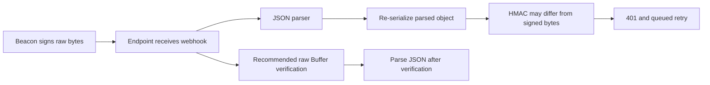

# 🟠 Triage Report: SUP-1002 — Webhook signature failures
**Ticket:** SUP-1002  
**Priority:** P2  
**Issue Type:** Integration / bug-shaped regression  
**Product Area:** Webhook signature verification and rotation  
**Environment:** Node.js/Express; versions, hosting, region and plan unknown  
**Investigation Mode:** read-only, offline synthetic sources

## 📖 Context for Reviewers
The customer needs order events delivered to its order service. Webhooks authenticate delivery using a signature over raw request bytes: see [webhook guide](../mock-sources/docs/webhooks.md). The endpoint now returns 401 after a middleware deployment and signing-secret rotation. All deliveries to this endpoint are reported affected; wider scope is unknown.

## Issue Summary
The customer reports every webhook failing since 2026-04-30, with a growing retry queue. The supplied code hashes JSON.stringify(req.body) after globally mounting express.json(). Failures persisted after a secret reload. Neither a Beacon rotation defect nor permanent event loss is established.

## Intake
ASSUMING: Node.js/Express order service, region and plan unknown, all deliveries to this endpoint affected.
→ Correct me now or I proceed with these.

| Field | Value |
|---|---|
| Issue Type / Product Area | Integration regression; signature verification |
| Timeframe | Ticket-relative yesterday is 2026-04-30; not the investigation date. Log window 13:58:41–14:21:30 UTC |
| Impact | Reported endpoint-wide 401s and queued order events; counts, business impact and retention unknown |
| Environment | Node.js crypto, Express shared JSON middleware; versions unknown |
| Identifiers | SUP-1002; build 2291; dlv_7781, dlv_7790, dlv_7791; order.paid, order.created |
| Reproduction | Rotate secret and deploy shared parser; hash re-serialized body; observed 401. No controlled reproduction run |
| Missing Context | Middleware order; exact rotation time; deployed secret identity verified without disclosure; one fresh delivery verification result; queue counts and retention |
| Sensitive input | Signing-secret value and personal contact details omitted |

## Evidence Gathered
| # | Source / Query | Finding | Status |
|---|---|---|---|
| 1 | tickets/002-webhook-signature-failures.md, supplied code | HMAC uses JSON.stringify(req.body); customer reports global express.json() | ✅ Verified as customer-supplied evidence |
| 2 | Same ticket, UTC log excerpt | 13:58:41 success; 14:02:10 build 2291 deployment; 14:03:55 and 14:04:02 signature mismatch/401; 14:20:17 secret reload; 14:21:30 retry attempt 3 still 401 | ✅ Verified as supplied log observations; not independently authenticated |
| 3 | mock-sources/docs/webhooks.md | Hex HMAC-SHA256 over raw body; route-specific express.raw; parse after verification | ✅ Verified fixture documentation |
| 4 | mock-sources/docs/webhooks.md, rotation/timestamps | New secret immediately; previous-secret header for 24 hours; reject requests older than 5 minutes per Beacon-Timestamp | ✅ Verified fixture documentation |
| 5 | mock-sources/issues/BEACON-151.md, full body | Open docs issue matches global JSON parser and signature failures; workaround is verify Buffer before parsing; updated 2026-05-01 | ✅ Verified fixture issue |
| 6 | mock-sources/issues/BEACON-097.md, BEACON-118.md, BEACON-142.md, BEACON-160.md; full bodies | Export, Safari identity, browser unload delivery and dashboard issues concern other components | ✅ Verified inspected candidates |
| 7 | mock-sources/status/incidents.md; release/docs/status search | Supplied incidents concern ingestion on April 11 and dashboards on May 2; no listed webhook incident. Release search returned no webhook match | 🔍 Search finding within fixtures only |
| 8 | Customer/system data access | No raw bytes, received signature, endpoint config or live queue data supplied; no controlled reproduction | ❌ Unverified operational state |

## 🐛 Known-Issue Search
Offline tracker searched: mock-sources/issues/. These are local text searches, not semantic API queries.
| # | Query type | Repo / tracker | Executed query | Best Candidate | Conclusion |
|---|---|---|---|---|---|
| 1 | Hybrid via synonyms | mock-sources/issues/ | rg -n -i 'parsed\|verification\|reserial\|re-serial\|body parser\|hmac' mock-sources/issues | BEACON-151 | Accepted symptom/mechanism match |
| 2 | Broad lexical | mock-sources/issues/ | rg -n -i 'signature\|signing\|rotation\|raw body\|middleware\|401\|secret\|updated:' mock-sources/issues | BEACON-151 | Accepted; rotation not independently verified |
| 3 | Exact surface | mock-sources/issues/ | rg -n 'Beacon-Signature\|signature mismatch\|express.json\|JSON.stringify' mock-sources/issues | BEACON-151 | Parser phrase match |
| 4 | Recent sweep | mock-sources/issues/ | Same broad query including updated:; compare all returned dates with April 30 onset | BEACON-151 updated May 1 | Closest relevant date; other updates inspected |

**Candidate inspection:** Full bodies of all five issues were read. BEACON-151 is an open documentation issue, not evidence of a rotation defect. BEACON-142 is rejected because its browser requests never reach ingestion, whereas this endpoint receives requests and returns 401. BEACON-160 concerns dashboard tiles; BEACON-118 concerns identity continuity; BEACON-097 concerns exports.
**Related sources searched:** rg -n -i 'webhook\|signature\|rotation\|secret' mock-sources/releases mock-sources/docs mock-sources/status.
**Search gaps:** Fixtures only, no live tracker or account access; fixture dates after onset describe available snapshot knowledge. No Beacon web search performed because Beacon is fictional.

## 🗺️ How It Works (and Where It Breaks)

The current verifier compares a re-serialized representation against the raw-body signature (rows 1, 3). Byte changes are plausible but not guaranteed for every JSON body. Rotation changes the signing key, not the raw-body requirement (row 4).

## 🎯 Root-Cause Assessment
**Assessment:** Body parsing before verification is the leading explanation. The verifier violates the documented raw-byte requirement; a simultaneous stale or incorrect secret remains possible.

**Confidence:** Likely based on pattern match

**Reasoning:** Customer code and deployment-correlated logs (rows 1–2), raw-body requirements (row 3), and matching issue BEACON-151 (row 5) strongly support the hypothesis. No failing request's raw bytes and signature were compared, so the actual byte mismatch is not proven. The reload log proves a reload was reported, not that the deployed key matches the endpoint. No rotation defect is confirmed. The full fixture search gate is complete.

**Not explained:** Exact rotation timing, whether all bodies changed under re-serialization, whether the deployed key matches, queue retention/recovery and any permanent loss.

## Recommended Next Action
1. 🔧 Give the documented raw-body workaround: route-specific express.raw({ type: 'application/json' }), verify HMAC against its Buffer, then parse JSON. Ensure the shared parser does not process this route first; this ordering is an inference from the raw-byte requirement.
2. Validate one fresh delivery using the configured new secret and Beacon-Signature. Confirm rotation time and middleware order without disclosing key values. Do not bypass signature or timestamp checks.
3. 🚨 Human support should assess queued delivery counts, oldest age, retention and safe recovery options; these are not documented in supplied fixtures. Do not promise replay or absence of data loss.
4. If fresh raw-body verification still fails, obtain a safe delivery ID, UTC time, header presence, middleware layout and secret-version confirmation for engineering.

### Reproduction (status: not yet run)
**Environment:** Node.js/Express, versions/region/plan unknown.  
**Preconditions:** Isolated synthetic endpoint and synthetic signing key; no customer payloads or production changes.
1. Send a synthetic JSON body with formatting whitespace and a matching raw-byte HMAC (source: docs; synthetic test setup assumed).
2. Parse it with the shared JSON parser and verify using the ticket's re-serialization approach (source: ticket).
3. Compare against a control that verifies the same raw Buffer before parsing, keeping the key and body constant (source: docs/BEACON-151).
**Expected:** Control signature matches; the changed representation should mismatch for the whitespace-containing test body (rows 3, 5; inference).
**Actual:** Customer supplied 401 logs; proposed reproduction has not run (row 2).
**Control:** Change only verification input/processing order; test rotation separately afterward.
**Frequency:** Customer reports every delivery; excerpt contains three mismatch entries, not a full failure-rate measurement.

## Escalation Decision
**Decision:** Recommend human support/engineering review; brief prepared below, nothing filed or sent.
**Reason:** P2 order processing disruption and possible loss require queue/recovery verification beyond fixture evidence.
**Suggested owner:** Webhook delivery/signing component.
**Follow-up cadence:** Review after the fresh raw-body verification result; no timeline promised.

### Engineering-ready escalation brief
**Ticket / severity:** SUP-1002 / High.  
**Impact:** One endpoint reportedly rejects all order webhooks; queue grows. Other customers, exact volume and permanent loss unknown.  
**First observed:** April 30, 2026 14:03:55 UTC after build 2291; last provided failure 14:21:30 UTC.  
**Summary:** Leading integration hypothesis is re-serialization before HMAC, with concurrent rotation as a confounder. Production receiver is rejecting deliveries; no platform-wide defect shown.  
**Reproduction:** Use the numbered, unrun synthetic reproduction above.  
**Expected / actual:** Raw-byte verification should match; supplied customer logs show 401.  
**Evidence:** Rows 1–8 above.  
**Support checked:** Supplied code/log timeline, full issue matrix, webhook docs, listed incidents and release search. No deployment, replay, repair or customer-system test performed.  
**Closest issue:** BEACON-151, open documentation issue, strong mechanism match.  
**Specific ask:** Verify endpoint signing-key transition and fresh delivery outcomes; determine backlog retention and supported safe recovery; investigate signing only if correct raw bytes and configured new key still fail.  
**Workaround:** Verify raw Buffer before parsing (rows 3, 5). Success on this endpoint remains unverified.  
**Filed by support:** Not filed; draft handoff only.

## 🔎 Verify This Report
1. Open tickets/002-webhook-signature-failures.md: verify the parser/code and UTC sequence around build 2291.
2. Open mock-sources/docs/webhooks.md: verify raw-byte input, rotation headers and 24-hour window.
3. Open mock-sources/issues/BEACON-151.md: verify matching symptoms and Buffer-before-parse workaround; distinguish docs issue from rotation defect.
4. Have a human run the isolated control above; check one fresh endpoint delivery separately, with secrets withheld.
5. Have support verify queue state and retention before making any recovery or data-loss claim.

## 💬 Draft Customer Response
Thanks for the deployment timeline and verification code. The most likely cause is that the shared JSON middleware parses the webhook body before verification. Beacon signs the exact raw bytes; computing the HMAC from JSON.stringify(req.body) can produce different bytes and fail verification even with the correct secret.

Configure the webhook route to receive the raw body with express.raw({ type: 'application/json' }), before the shared JSON parser processes that route. Compute the HMAC from that Buffer, then parse the JSON after verification succeeds.

Rotation uses the new secret immediately. For 24 hours after rotation, Beacon also supplies Beacon-Signature-Previous using the old secret. Your code checks Beacon-Signature, so it should use the new secret.

Please confirm the middleware order and the UTC rotation time, and provide one fresh delivery ID and its verification result after the raw-body change. Do not send signing secrets or customer payloads. The growing retry queue shows delivery failures; it does not establish permanent event loss. The findings need human review to check the queued deliveries and determine recovery options.

--- END OF CUSTOMER-FACING CONTENT ---

## 🔬 Evidence Pack (internal only)
Pre-send spot check: all cited references verified.

### Engineer TL;DR
The provided verifier hashes re-serialized JSON; the fixture guide requires raw bytes. Matching issue and deployment timing make this a strong hypothesis, with actual failing bytes and deployed key still unverified. Review the production backlog and confirm fresh raw-body verification before attributing the outage to rotation.

### Claim-Source Map
| # | Claim | Source (row #) | Status |
|---|---|---|---|
| 1 | Customer verifier uses re-serialization | 1 | Verified |
| 2 | Supplied failures follow deployment and persist after reload | 2 | Verified |
| 3 | Raw-body HMAC is documented | 3 | Verified |
| 4 | Rotation header behavior and 24-hour window are documented | 4 | Verified |
| 5 | BEACON-151 matches and is a docs issue | 5 | Verified |
| 6 | Other inspected candidates concern different components | 6 | Verified |
| 7 | Parsing is the actual cause of these failures | 1–5 | Inferred |
| 8 | Raw-route ordering prevents prior parsing | 3, 5 | Inferred |
| 9 | Middleware workaround restores this endpoint | 8 | Unverified |
| 10 | Actual deployed key matches endpoint's new key | 8 | Unverified |

### Unknowns
No live project/account connector used; confidence limited by lack of project data access. Raw body, received headers, key identity, rotation time, full failure counts, queue retention and recovery semantics are unknown. Supplied snapshot does not verify current production state.

### Anti-hallucination review
Claims extracted and mapped above; observed code/log facts separated from causation. No contradiction between immediate new-key signing and a previous-key secondary header. Reload alone cannot exclude key mismatch. No independent incident conclusion, permanent-loss assertion or successful-fix claim made. Recommendations trace to fixture docs/issue; middleware order is explicitly inferred. All cited files were read this session; no product version claim or external URL invented.

### Confidence Score
**Overall:** Medium, 70%.
- Verified claims: 6
- Inferred claims: 2
- Unverified claims: 2
- Arithmetic: (6 + 2 × 0.5) / 10 × 100 = 70%.
- Caps applied: matching candidate not conclusively verified on customer setup caps at Medium (70%). Root confidence remains Likely; no raw-byte reproduction proves causation.

### Redaction confirmation
Redaction pass: 2 sensitive input spans omitted before saving (signing secret and personal contact/signature block); neither appears in either output. No customer payloads, private URLs or internal admin links retained.

