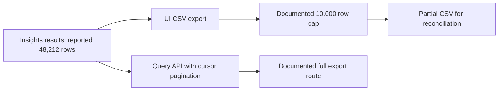

# 🟢 Triage Report: SUP-1003 — CSV export stops at 10,000 rows

**Issue Type:** Data / How-to (bug-shaped intake)
**Product Area:** Insights table UI CSV export
**Priority:** P4
**Investigation Mode:** Read-only; offline synthetic Beacon fixtures

## 📖 Context for Reviewers

The customer needs a complete March dataset for finance reconciliation. The Insights table reports 48,212 rows, but the downloaded CSV contains 10,000 data rows plus a header [E1]. Export documentation describes a UI limit and full-export alternatives [E2].

## Issue Summary

The customer reports that March CSV downloads always stop at exactly 10,000 data rows. The documented UI cap likely explains the discrepancy [E1–E3]; no customer file or account was inspected.

## Intake

ASSUMING: Beacon Insights web export, region and plan unknown, one reported customer with broader scope unknown.
→ Correct me now or I proceed with these.

| Field | Value |
|---|---|
| Issue Type / Area | Data / How-to; Insights UI CSV |
| Timeframe | March dataset; year, onset and ticket date unspecified |
| Impact | Full finance reconciliation list unavailable through one UI export; broader scope unknown |
| Environment | Web UI inferred; browser, product version, region and plan unknown |
| Identifiers | SUP-1003 |
| Reproduction | Export March Insights table; expected 48,212 rows, reported actual 10,000 plus header, always |
| Missing Context | Actual CSV and query/filter parity not verified; plan needed only to assess warehouse option |

## Evidence Gathered

| # | Source / Query | Finding | Status |
|---|---|---|---|
| E1 | tickets/003-csv-export-truncated.md | Customer reports 48,212 displayed rows and exactly 10,000 exported data rows | ✅ Verified as ticket content; outcome not independently verified |
| E2 | mock-sources/docs/exports.md | UI export capped at 10,000 in current sort order; limit banner; full export via Query API cursor pagination or plan-dependent scheduled warehouse export | ✅ Verified fixture documentation |
| E3 | mock-sources/issues/BEACON-097.md | Exact matching cap; open feature request, updated 2026-04-22; guidance: paginated API or smaller date-range batches; no committed delivery date | ✅ Verified fixture issue |
| E4 | mock-sources/issues/BEACON-160.md | EU dashboard tiles showing No data while direct insights work | ✅ Verified; rejected as different surface and symptom |
| E5 | Four rg search passes over mock-sources/issues/ (matrix below) | Export candidate BEACON-097 found across matrix; updated dates inspected across all five issues | ✅ Verified executed searches |

## 🐛 Known-Issue Search

| # | Query type | Repo / tracker | Exact executed query | Best Candidate | Conclusion |
|---|---|---|---|---|---|
| 1 | Hybrid synonym discovery | mock-sources/issues/ | rg -n -i 'truncat\|missing rows\|incomplete\|limit\|cap\|export\|csv' mock-sources/issues | BEACON-097 | Accepted exact cap match |
| 2 | Broad lexical | mock-sources/issues/ | rg -n -i 'export\|csv\|rows' mock-sources/issues | BEACON-097 | Accepted; other browser SDK hits were lexical noise |
| 3 | Exact surface | mock-sources/issues/ | rg -n -F -e '10,000' -e 'Export CSV' -e '48,212' mock-sources/issues | BEACON-097 | Exact 10,000 match; other exact strings not found |
| 4 | Recent sweep | mock-sources/issues/ | rg -n -i 'export\|csv\|rows\|updated:' mock-sources/issues; rg -n 'updated:\|created:' mock-sources/issues | BEACON-097 | Matching issue updated 2026-04-22; later fixture updates through 2026-05-04 concern other areas |

**Candidate inspection:** Full bodies of BEACON-097 and BEACON-160 read. BEACON-097 accepted as a documented limitation and feature request, not evidence of a new export regression. BEACON-160 rejected because intermittent EU dashboard rendering does not explain an exact CSV row cap [E3–E5].

**Search gaps:** Fixture snapshot only, not a live service. Ticket timeframe cannot be correlated with issue dates because March year and onset are unspecified. No external repositories searched; offline demo rules apply.

## 🗺️ How It Works (and Where It Breaks)

The UI export includes only the first 10,000 rows in the current sort order [E2]. The gap occurs at the documented export limit.

## 🎯 Root-Cause Assessment

**Assessment:** The documented Insights UI export limit likely explains the exact truncation; this matches expected documented behavior rather than establishing a new bug.

**Confidence:** Likely based on pattern match

**Reasoning:** Reported count [E1] matches the explicit documentation [E2] and exact tracker candidate [E3]. The full offline search gate ran [E5]. Confidence limited by lack of project data access; no CSV, traces, account state or reproduction on the customer's setup confirms the mechanism.

**Not explained:** Whether the customer saw the banner, whether displayed and exported filters match, and whether all 48,212 rows remain obtainable through a full-export route.

## Recommended Next Action

1. Use the documented Query API cursor-pagination route for complete exports [E2]; docs identify GET /api/v2/query with cursor, but do not supply a complete request schema or authentication recipe.
2. Alternatively, narrow dates and export batches [E3]. As a verification precaution, use non-overlapping ranges, keep each batch below the cap and reconcile counts.
3. Consider scheduled warehouse export only after checking plan entitlement [E2]. No setting to increase the UI cap is documented in the inspected sources.
4. If a below-limit export still loses rows or a full-export route fails, obtain sanitized counts, matching filters, time boundaries and request identifiers for renewed investigation.

### Reproduction (status: not yet run)

**Environment:** Beacon web UI assumed; version, browser, region and plan unknown.
**Preconditions:** Synthetic Insights dataset exceeding 10,000 rows (assumed).

1. Open an Insights table for March (source: ticket).
2. Note the result count and current sort order (sources: ticket, E2).
3. Select Export CSV and count data rows excluding the header (sources: ticket, E2).

**Expected:** At most 10,000 rows, first rows in current sort order, and a limit banner [E2].
**Actual:** Customer reports 10,000 plus header against 48,212 displayed [E1].
**Control:** Change only the date range to yield fewer than 10,000 rows; compare exported and displayed counts (proposed test, not performed).
**Frequency:** Always, according to the ticket.

## Escalation Decision

**Decision:** No engineering escalation needed on current evidence.
**Reason:** Strong match to documented cap and existing feature request [E2–E3]; revisit if the control export contradicts documentation.
**Suggested owner if escalated:** Insights exports component; exact team unknown.
**Follow-up cadence:** On customer evidence of below-limit or paginated-export failure; no timeline promised. Nothing filed or sent.

## 🔎 Verify This Report

1. Open mock-sources/docs/exports.md: verify cap, sort order, banner and conditional warehouse option.
2. Open mock-sources/issues/BEACON-097.md: verify open feature-request status and both workarounds.
3. Repeat the exact search matrix above and inspect updated dates; do not infer ticket onset from March.
4. Have a human perform the control reproduction using synthetic data, then compare counts. It has not been run.

## 💬 Draft Customer Response

Hi,

Thanks for noting the exact row count. Beacon’s Insights CSV export is documented to include up to 10,000 data rows, so your result is consistent with that limit. Larger results include the first 10,000 rows in the table’s current sort order; the export dialog should show a limit banner.

For your full March reconciliation, use the Query API with cursor pagination, or narrow the date range and export in batches. Keep each batch below the limit and use non-overlapping ranges to avoid counting rows twice.

Scheduled warehouse exports are another documented option on plans that include them. If a smaller batch still loses rows, please share its displayed count and exported data-row count so support can review the discrepancy.

--- END OF CUSTOMER-FACING CONTENT ---

## 🔬 Evidence Pack (internal only)

✅ Pre-send spot check: all cited references verified.

### Engineer TL;DR

An exact 10,000-row CSV result matches the documented UI cap. Provide the documented full-export route or date batches; customer-specific causality remains inferred. No engineering action or customer message was sent.

### Claim-Source Map

| # | Claim | Source | Status |
|---|---|---|---|
| 1 | Ticket reports 48,212 versus 10,000 plus header | E1 | Verified as report |
| 2 | UI cap, sort order and banner documented | E2 | Verified |
| 3 | Paginated Query API is documented full-export route | E2 | Verified |
| 4 | Warehouse export is conditional on plan | E2 | Verified |
| 5 | Exact open feature request supplies date-batch guidance | E3 | Verified |
| 6 | Customer's actual mechanism is UI cap | E1–E3 | Inferred |
| 7 | Four search types completed | E5 | Verified |

### Unknowns

Customer artifact, filter parity, banner visibility, product version, region, plan, March year and onset are unverified. Source fixtures cannot establish current production state. No source-code or no-error claim is made.

### Anti-hallucination Review

Claims extracted and mapped above. No contradiction between export docs and accepted candidate. Customer facts are attributed to the ticket, not treated as independent confirmation. API details limited to the inspected docs; no unverified config option or fix release promised. Batch boundary/count checks are proposed verification precautions, not product guarantees. Customer reply has no internal tracker references, queries, private links, personal names or action claims.

### Confidence Score

**Overall:** High evidence coverage: (6 verified + 1 inferred × 0.5) / 7 = 92.9%. Root-cause label remains Likely because customer-system confirmation is absent.

- Verified claims: 6
- Inferred claims: 1
- Unverified scored claims: 0 (unknowns listed separately)
- Caps applied: None; accepted candidate describes the limit, not an unresolved plausible bug. Fixture-only scope limits applicability.

### Redaction confirmation

Redaction pass: 1 personal-name omission in drafting, applied to both output files. No tokens, raw person properties, private URLs or admin links retained. All evidence paths are relative to the workspace.

