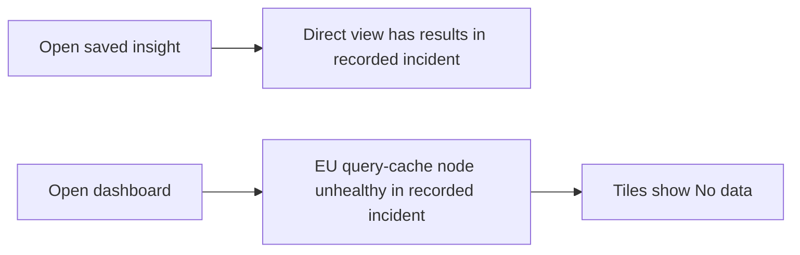

# 🔴 Triage Report: SUP-1004 — Team-wide blank dashboards

**Ticket:** SUP-1004
**Customer:** [organization omitted]
**Issue Type:** Bug
**Product Area:** Dashboard tile loading / query cache
**Priority:** 🔴 P1 (ticket priority)
**Plan Tier / SLA:** Unknown
**Environment:** Beacon; browser, SDK, hosting and region unknown
**Investigation Mode:** Read-only, synthetic offline sources
**Investigation date:** 2026-10-07; ticket describes 2026-05-02

## 📖 Context for Reviewers

The customer needs dashboards for a board meeting at noon. All tiles reportedly show “No data” for the whole team. The stack is unknown. No dashboard-specific documentation is supplied; the relevant feature behavior is described in `mock-sources/issues/BEACON-160.md`. This investigation examines historical fixtures, not live service health.

## Issue Summary

At 08:40 UTC on May 2, the customer reported team-wide blank dashboards that morning and requested an urgent fix. A contemporaneous EU dashboard incident is a strong candidate, but project region and direct-insight behavior are missing. No customer system was accessed or reproduced.

## Intake

ASSUMING: Beacon dashboard UI; stack, region and plan unknown; team-wide impact as reported.
→ Correct me now or I proceed with these.

| Field | Value |
|---|---|
| Issue Type / Area | Bug / dashboard tile loading |
| Timeframe | Morning of 2026-05-02; sent 08:40 UTC; exact onset and current persistence unknown |
| Impact | Whole team reportedly affected; board meeting at noon, timezone unspecified; ingestion impact unknown |
| Environment | Browser, OS, SDK/version, region, plan and hosting unspecified |
| Identifiers | SUP-1004; no project, dashboard, insight or request ID |
| Reproduction | Customer reports every dashboard tile shows “No data”; no numbered steps or frequency measurements |
| Missing Context | Project ID and region; whether an affected insight works directly with identical date range and filters |

## Evidence Gathered

| # | Source / Query | Finding | Status |
|---|---|---|---|
| 1 | `tickets/004-dashboards-blank.md` | P1; whole team; all tiles “No data”; May 2 08:40 UTC; noon meeting | ✅ Verified as customer report, not independently reproduced |
| 2 | `mock-sources/issues/BEACON-160.md` full body | Open; created/updated May 2; EU tiles “No data”; same insight works directly; onset around 08:10 UTC; query-cache node under investigation | ✅ Verified fixture content |
| 3 | `mock-sources/status/incidents.md` | May 2 EU dashboard incident: investigating 08:10; unhealthy query-cache node identified 09:05; recorded status Monitoring; US unaffected in that incident | ✅ Verified historical fixture; not current health |
| 4 | Four issue search modes below, plus full candidate reads | BEACON-160 matches symptom and date; other candidates concern Safari delivery and CSV export | ✅ Verified search results |
| 5 | `mock-sources/docs/browser-sdk.md`, `exports.md`, `webhooks.md`; `mock-sources/releases/browser-sdk.md` | Supplied docs/releases provide no dashboard-cache recovery procedure | ✅ Verified scope of supplied documents |
| 6 | Customer project evidence | Region, direct-insight result, request traces and recovery not available; no relevant live customer-data query performed | ❌ Unverified |
| 7 | `mock-sources/README.md` | Sources are synthetic, read-only stand-ins for fictional Beacon | ✅ Verified |

## 🐛 Known-Issue Search

All searches executed against `mock-sources/issues/`; offline hybrid means synonym/paraphrase expansion, not semantic search.

| # | Query type | Repo / tracker | Exact executed query | Best Candidate | Conclusion |
|---|---|---|---|---|---|
| 1 | Hybrid | mock-sources/issues | `rg -n -i 'blank\|empty\|no results\|no data\|dashboard\|tile\|query\|outage' mock-sources/issues` | BEACON-160; BEACON-097 | 160 accepted as likely candidate; 097 rejected |
| 2 | Lexical | mock-sources/issues | `rg -n -i -e dashboard -e tile -e query -e ingestion mock-sources/issues` | BEACON-160; BEACON-142; BEACON-097 | 160 relevant; other surfaces differ |
| 3 | Exact | mock-sources/issues | `rg -n -F 'No data' mock-sources/issues` | BEACON-160 | Exact visible message match |
| 4 | Recent | mock-sources/issues | `rg -n -i 'updated:\|created:\|dashboard\|query\|incident' mock-sources/issues` | BEACON-160 | Compared all front-matter dates; May 2 creation/update matches ticket day |

**Matching issue:** `mock-sources/issues/BEACON-160.md`, open. Accept as a likely pattern match, conditional on EU region and direct insights retaining results.

**Closest rejected candidates:** `mock-sources/issues/BEACON-142.md` concerns Safari events lost before navigation, not dashboard-only rendering; customer browser/version unknown, so it is not established as this cause. `mock-sources/issues/BEACON-097.md` concerns CSV row limits, not blank tiles. Full bodies fetched. BEACON-118 and BEACON-151 were also read and concern identity continuity and webhook signatures.

**Search gaps:** Matrix complete for supplied fixtures only. No live tracker or customer telemetry. BEACON-142's May 4 update postdates the ticket; do not treat its later fix as available on May 2.

## 🗺️ How It Works (and Where It Breaks)

The following is a symptom-path sketch grounded in rows 2–3, not a verified implementation diagram.

Direct results versus empty dashboard tiles would support a dashboard-serving problem. Neither direct results nor cache involvement has been established for this customer.

## 🎯 Root-Cause Assessment

**Assessment:** Likely association with the May 2 EU dashboard query-cache incident; customer-specific root cause remains unconfirmed.

**Confidence:** Likely based on pattern match

**Reasoning:** Rows 1–3 align on date, dashboard tiles and exact message. The customer reported at 08:40, after incident investigation began at 08:10. The node identification at 09:05 is later historical evidence, not something known at ticket receipt. Row 6 prevents confirmation: region and direct-insight behavior are unknown. Status and issue evidence alone cannot prove this customer's cause. The plausible candidate cap of Medium (70%) applies.

**Not explained:** Whether the project is EU, whether every tile is continuously affected rather than intermittently, whether direct insights work, whether ingestion is healthy, and whether service later recovered.

## Recommended Next Action

1. 🚨 Human operator: route this P1 report to the dashboard/query-cache incident owner without waiting for customer evidence; link the likely incident conditionally. No escalation has been sent by this agent.
2. Ask for project ID, region and direct-insight result with the same date range and filters. Opening an insight directly is a source-grounded possible workaround (rows 2–3), not a guaranteed recovery.
3. Obtain contemporaneous project request evidence and current incident state. If region is US or direct insights also fail, broaden diagnosis beyond the EU dashboard incident; do not assume data loss or recommend SDK/config changes.

### Reproduction (status: not yet run)

**Environment:** Beacon, customer region/browser/version unknown.
**Preconditions:** An affected dashboard and its underlying saved insight; human operator with authorized access.

1. Open an affected dashboard (proposed action based on ticket).
2. Observe whether tiles show “No data” (customer-reported outcome, row 1).
3. Open the same insight directly, preserving date range and filters (comparison proposed from rows 2–3).

**Expected:** Dashboard should show the relevant insight results when present; expectation inferred from feature use and row 2.
**Actual:** Blank dashboard tiles reported; direct-view outcome unknown.
**Control:** Same insight, same filters/date range, direct view instead of dashboard; recorded incident predicts direct results.
**Frequency:** All tiles/team reported; repeat counts unknown.

## Escalation Decision

**Decision:** Escalate to engineering — recommendation and prepared brief only; not filed.
**Reason:** P1 team-wide impact and plausible product incident; support cannot confirm scope or restore service using supplied evidence.
**Suggested owner:** Dashboard/query-cache on-call, EU incident owner if region verified.
**Follow-up cadence:** Human owner to use applicable P1 incident process; SLA and update schedule unavailable. No promised timeline.
**Brief:** Attached below in the Evidence Pack; reproduction above applies.

## 🔎 Verify This Report

1. Read `tickets/004-dashboards-blank.md`: confirm 08:40 May 2, whole team and exact message.
2. Read `mock-sources/issues/BEACON-160.md`: verify EU scope, direct insight results and May 2 dates.
3. Read `mock-sources/status/incidents.md`: verify 08:10/09:05 sequence; distinguish historical Monitoring from recovery.
4. Have an authorized human confirm project region and compare the same insight directly with identical filters/date range. EU plus direct results strengthens the match; contrary results require broader investigation.

## 💬 Draft Customer Response

I understand that the whole team is seeing blank dashboards ahead of your board meeting.

Your report matches a dashboard incident recorded on May 2 affecting some EU-region projects. We still need to confirm whether your project is affected. In that incident, insights opened directly continued to show results, so please try opening an affected insight directly for your meeting.

Could you share your project ID and region, and whether that same insight shows data when opened directly with the same date range and filters? These details will help a support engineer confirm the connection and review the issue with engineering. We cannot yet confirm recovery for your project.

--- END OF CUSTOMER-FACING CONTENT ---

## 🔬 Evidence Pack (internal only)

Pre-send spot check: all cited references verified.
Checks performed: source-to-claim mapping; exact incident timing; candidate body inspection; contradiction review; workaround scope; no claimed filing/fix/reproduction. No version, live-health, data-loss or recovery assertion in customer response.

### Engineer TL;DR

Likely historical EU dashboard incident match, not customer-confirmed. Keep P1 priority and request region plus direct-insight comparison. No live system changes, escalation, browser reproduction or recovery check performed.

### Claim-Source Map

| # | Claim | Source (row #) | Status |
|---|---|---|---|
| 1 | Customer reported whole-team blank dashboards at May 2 08:40 | 1 | Verified as reported |
| 2 | BEACON-160 describes EU dashboard tiles with matching message/date | 2 | Verified |
| 3 | Incident record identifies unhealthy query-cache node at 09:05 | 3 | Verified |
| 4 | Direct insights unaffected in recorded incident | 2–3 | Verified |
| 5 | Customer is affected by that incident | 1–3, 6 | Inferred |
| 6 | Direct insight may offer this customer a workaround | 2–3, 6 | Inferred |
| 7 | Customer is EU and currently recovered | 6 | Unverified; neither asserted as fact |

### Unknowns

Project identity/region; exact onset and persistence; direct-insight behavior; browsers; logs; ingestion state; meeting timezone; current status; applicable SLA. No supplied dashboard documentation or implementation source. No contradiction found in fixture descriptions; customer reports broader scope than incident's “some” projects/intermittent behavior.

### Confidence Score

**Overall:** Medium, 70%.
Verified claims: 4; inferred claims: 2; unverified claims: 1.
Arithmetic: (4 + 2 × 0.5) / 7 × 100 = 71.4%.
Caps applied: plausible known-issue candidate not ruled out → Medium (70%). No customer-specific root-cause confirmation; full offline search gate complete.

### Redaction confirmation

Redaction pass: 1 organization-name omission across the report; no secrets, personal data, private URLs or internal admin links in either output. Customer draft contains no fixture paths, issue IDs, raw queries or internal tools. All evidence paths are workspace-relative.

### Escalation Brief — prepared, not filed

**Ticket:** SUP-1004
**Customer Impact:** Whole team cannot use dashboards; board meeting at noon per ticket.
**Severity:** Critical / P1 as reported
**Suggested Owner:** Dashboard/query-cache on-call
**Filed by support:** Not filed; read-only prepared brief
**Date:** Investigation 2026-10-07; event 2026-05-02

#### Summary

A dashboard outage report closely matches the recorded May 2 EU query-cache incident. Engineering should establish project scope, inspect dashboard-serving evidence and confirm incident correlation; region and direct-insight behavior remain missing.

#### Customer Impact

| Field | Value |
|---|---|
| Affected customers | One organization reported; incident record mentions some EU projects |
| Estimated blast radius | Whole reporting team; count unknown |
| First seen | Morning May 2; report 08:40 UTC |
| Regression vs longstanding | Sudden onset reported; release correlation unknown |
| Production-down? | Dashboard function unavailable as reported; wider product availability unknown |
| Workaround available? | Direct insight proposed from incident; unverified for customer |

#### Reproduction

Use the unrun reproduction in Recommended Next Action unchanged. Project/insight identity and region are the minimum missing artifacts.

#### Expected Behavior

Dashboard displays relevant insight results when available; expectation inferred, not verified on customer setup.

#### Actual Behavior

All tiles reportedly show “No data”; no direct-insight result supplied.

#### Evidence

| # | Source | Finding | Status |
|---|---|---|---|
| 1 | `tickets/004-dashboards-blank.md` | Team-wide report at 08:40 | Verified report |
| 2 | `mock-sources/issues/BEACON-160.md` | Matching date/message, conditional EU scope | Verified source; customer match inferred |
| 3 | `mock-sources/status/incidents.md` | Query-cache node identified at 09:05 | Verified historical record |

#### What Support Already Tried

Read ticket, completed offline search matrix, inspected full issue candidates and historical status, and reviewed supplied docs/releases. No customer system intervention or actual workaround test.

#### Closest Known Issues

| Issue | State | Match level | Reason |
|---|---|---|---|
| BEACON-160 | Open in fixture | Strong, conditional | Same date/message; region/direct result unknown |
| BEACON-142 | Closed in later fixture | Weak/rejected | Safari navigation event loss, different symptom |
| BEACON-097 | Open in fixture | Rejected | CSV limit, different feature |

#### Specific Ask

Confirm project region and whether requests used the affected cache node during the reported window. Compare direct-insight and dashboard responses with identical filters; establish present recovery separately. If correlation fails, investigate broader query/ingestion availability with customer evidence.

#### Workaround

Open an affected insight directly with unchanged date range/filters; recorded incident says these views were unaffected. Do not guarantee success or infer no data loss.

