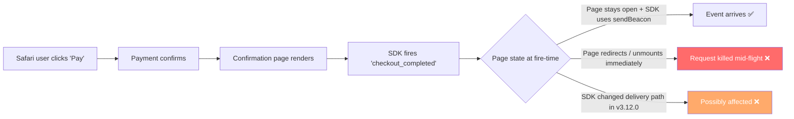

# Support Triage Report

**Ticket:** Safari checkout completion event missing for ~50% of users after frontend deploy
**Customer:** Acme Analytics
**Issue Type:** Bug / Integration
**Product Area:** Event ingestion — page-lifecycle delivery
**Priority:** 🟠 P2 — High
**Plan Tier (if known):** Unknown
**SLA Target (if applicable):** Same business day
**Environment:** Safari 17–18, Next.js, browser analytics SDK v3.12.0
**Investigation Mode:** read-only

---

## 📖 Context for Reviewers

> **What the customer is trying to do:** Track checkout completions in their analytics dashboard from a Next.js web app, including users who complete checkout on Safari.
>
> **Which feature is involved:** A browser analytics SDK that fires the `checkout_completed` event from the payment confirmation page after a successful purchase.
>
> **What's going wrong (in plain English):** About half of Safari users no longer show up as having completed checkout, even though they reach the confirmation page. Chrome looks fine. The issue began the moment the customer deployed a new frontend version that included an SDK upgrade.
>
> **Customer's stack:** Next.js, browser analytics SDK v3.12.0, US region. SDK vendor not stated in the ticket.

## Issue Summary

Acme Analytics reports that `checkout_completed` is missing for roughly half of Safari users after a frontend deployment on 2026-04-28 at 14:00 UTC. Chrome appears unaffected. The event is sent from the payment confirmation page after checkout succeeds. The issue correlates exactly with the deployment of frontend `2026.04.28.2`, which included a bump to browser analytics SDK v3.12.0.

## Intake

| Field | Value |
|---|---|
| Timeframe | Started immediately after frontend `2026.04.28.2` on 2026-04-28 14:00 UTC; ongoing |
| Impact | ~50% of Safari users completing checkout for a single P2 customer; analytics gap, not user-facing breakage |
| Identifiers | Event: `checkout_completed`; SDK: browser analytics SDK v3.12.0; Frontend version: `2026.04.28.2` |
| Reproduction | Visit confirmation page in Safari 17 or 18 after payment succeeds → event missing in analytics dashboard for ~50% of cases. Chrome unaffected. |
| Missing Context | (1) The exact code that fires `checkout_completed` on the confirmation page. (2) A Safari network-tab capture from one affected checkout. (3) Whether the confirmation page redirects or unmounts immediately after rendering. (4) v3.12.0 release notes from the SDK vendor (vendor name not in ticket). |

## Evidence Gathered

| # | Source / Query | Finding | Status |
|---|---|---|---|
| 1 | Customer ticket | Issue began immediately after frontend deploy and SDK upgrade on 2026-04-28 14:00 UTC | ✅ Verified |
| 2 | Customer ticket | Safari 17–18 affected; Chrome appears normal | ✅ Verified |
| 3 | MDN — `Navigator.sendBeacon()` (https://developer.mozilla.org/en-US/docs/Web/API/Navigator/sendBeacon) | Analytics best practice is to send during `visibilitychange → hidden`, not `unload` / `beforeunload`; `sendBeacon` is async and survives page unload up to ~64 KiB | ✅ Verified |
| 4 | MDN — `pagehide` event (https://developer.mozilla.org/en-US/docs/Web/API/Window/pagehide_event) | `unload` / `beforeunload` are unreliable, especially on mobile, and prevent bfcache inclusion; `visibilitychange` is the recommended end-of-session signal, with `pagehide` as the next-best alternative | ✅ Verified |
| 5 | Bug-tracker hybrid search: `Safari sendBeacon missing events SDK` across all of GitHub | Top results are unrelated (payment widget bug, dependency bumps); no candidate matches the symptom | 🔍 Searched, no match |
| 6 | Bug-tracker lexical search: `Safari pagehide checkout event` | No results | 🔍 Searched, no match |
| 7 | Bug-tracker exact search: `"sendBeacon" Safari analytics` | No results | 🔍 Searched, no match |
| 8 | Bug-tracker recent sweep: `analytics SDK Safari unload missing` (sorted by updated) | No results | 🔍 Searched, no match |
| 9 | SDK vendor identification | Ticket does not name the SDK vendor; cannot target a specific repo or release-notes page for v3.12.0 | ❌ Unverified |

## 🐛 Known-Issue Search

| # | Query type | Repo / tracker | Query | Best Candidate | Conclusion |
|---|---|---|---|---|---|
| 1 | Hybrid | GitHub (all) | `Safari sendBeacon missing events SDK` (search_type=hybrid) | None on-symptom; top hits unrelated | no match |
| 2 | Lexical | GitHub (all) | `Safari pagehide checkout event` | — | no match |
| 3 | Exact | GitHub (all) | `"sendBeacon" Safari analytics` | — | no match |
| 4 | Recent | GitHub (all) | `analytics SDK Safari unload missing` sorted by updated | — | no match |

**Closest rejected candidates:** None on-symptom. Top hybrid hits were a payment-widget UI bug, unrelated dependency bumps, and an iPad CSS patterns thread — rejected because none describe Safari-specific event delivery loss.

**Search gaps:** The ticket does not identify the SDK vendor, so the search could not be repo-scoped. A vendor-specific search (the right repo + the right `v3.12.0` tag) would be much stronger and is the single biggest unknown. If Acme can name the SDK, the matrix should be re-run against that specific repo before final escalation.

## 🗺️ How It Works (and Where It Breaks)

## 🎯 Root-Cause Assessment

**Assessment:** The most likely cause is page-lifecycle timing. The event is fired immediately before redirect or unmount on the confirmation page, and Safari drops in-flight requests during navigation more aggressively than Chrome unless the request uses `sendBeacon` or `fetch` with `keepalive`. The SDK upgrade in v3.12.0 may have changed how delivery is dispatched on the unload path, but this cannot be verified without identifying the vendor and reading the v3.12.0 release notes.

**Confidence:** Likely based on pattern match.

**Reasoning:** The browser-platform fundamentals (rows 3 and 4) are confirmed by MDN — Safari's behavior on `unload` is well-documented and `sendBeacon` / `visibilitychange` are the established analytics-delivery pattern for this exact failure mode. The timing (deployment correlation) and the browser-asymmetry (Safari only) point strongly away from server-side ingestion failure. Caps applied: the SDK-specific delivery-behavior claim (row 9) is Unverified because the vendor is unknown — the report is therefore capped at Medium confidence per the agent's root-cause-Unverified rule.

## Recommended Next Action

1. 🔧 Have the customer test an explicit SDK flush before redirecting or unmounting the confirmation page — for example, await the SDK's flush method, or move the event fire into a `visibilitychange → hidden` handler. If the event reappears in Safari, this confirms the timing hypothesis.
2. Ask the customer for the SDK vendor name and the exact event-send snippet on the confirmation page. With the vendor named, re-run the Known-Issue Search Gate against that vendor's specific repo and release notes for v3.12.0.
3. Ask for a Safari network-tab capture from one affected checkout. If the request to the analytics endpoint succeeds (HTTP 2xx) but the event does not appear in the dashboard, this is no longer a delivery-timing issue and 🚨 should be escalated as a possible SDK regression or ingestion-side problem.
4. Compare event volume by browser before and after the `2026.04.28.2` deployment, scoped to checkout pages, to confirm the scope and rule out a coincident change.

## Escalation Decision

**Decision:** No escalation yet — support can handle initial verification.

**Reason:** Evidence currently points to integration-layer timing on the customer's side, and the workaround (explicit flush before redirect) is testable without engineering involvement. Escalate only if (a) the Safari network log shows the analytics request succeeded but the event still does not appear, or (b) a minimal reproduction confirms an SDK regression in v3.12.0.

**Suggested owner if escalated:** Browser SDK team of whichever vendor Acme is using.
**Follow-up cadence:** Same business day, since this affects checkout analytics for a P2 customer.

## 🔎 Verify This Report

1. [ ] **`sendBeacon` is the recommended way for analytics SDKs to flush data on page unload.**
   - Open [MDN — `Navigator.sendBeacon()`](https://developer.mozilla.org/en-US/docs/Web/API/Navigator/sendBeacon).
   - Confirm the page describes `sendBeacon` as the established pattern for sending analytics during page transitions and recommends `visibilitychange → hidden`.

2. [ ] **`unload` / `beforeunload` are unreliable on Safari and prevent bfcache.**
   - Open [MDN — `pagehide` event](https://developer.mozilla.org/en-US/docs/Web/API/Window/pagehide_event).
   - Confirm the page contrasts `pagehide` against `unload` / `beforeunload` and recommends `visibilitychange` as the primary end-of-session signal.

3. [ ] **The Known-Issue Search Gate found no on-symptom match in any public repo.**
   - Run: `gh api '/search/issues?q=Safari+sendBeacon+missing+events+SDK+in:title,body&search_type=hybrid&per_page=5' --jq '.items[] | {number,title,state,html_url}'`.
   - Confirm none of the returned issues describes a Safari-specific event-delivery loss; the matrix is repo-scoped only after the vendor is named.

--- END OF CUSTOMER-FACING CONTENT ---

## 💬 Draft Customer Response

Hi team,

Thanks for the detailed context — the deployment timestamp, the browser breakdown, and the SDK version made this much faster to diagnose.

What appears to be happening:

- The issue is isolated to Safari and started exactly at your frontend deploy on 2026-04-28 14:00 UTC, which lines up with the SDK bump to v3.12.0.
- Safari is more aggressive than Chrome about cancelling in-flight requests during page transitions. If the confirmation page redirects, unmounts, or unloads soon after the event is fired, Safari can drop the request unless the SDK uses `sendBeacon` or `fetch` with `keepalive` — both of which are designed for exactly this case.
- Whether v3.12.0 of your SDK changed how it handles that unload path is the part we cannot confirm yet without seeing the SDK vendor's release notes.

The fastest test: explicitly flush or `await` the SDK call before redirecting, closing, or unmounting the confirmation page. If you have a `flush()` method available, use that. Alternatively, move the event fire into a `visibilitychange` handler that runs when the page transitions to `hidden`. If Safari starts seeing the events again, that confirms the timing hypothesis and you have a workaround you can ship today.

To narrow this down further, could you share:

1. The code that fires `checkout_completed` on the confirmation page.
2. A network-tab capture from Safari for one affected checkout — specifically, what status code (if any) the analytics request gets.
3. The name of the analytics SDK vendor, so we can check the v3.12.0 release notes for any change to the unload-delivery path.

If the network log shows the request succeeded but the event still does not appear in the dashboard, that points to an SDK or ingestion-side issue and we should escalate it for engineering review. I will come back to you the same business day once we have those.

Thanks,
Support

---

## 🔬 Evidence Pack (internal only)

✅ Pre-send spot check: all cited references verified. Two MDN URLs were fetched live this session (rows 3 and 4); the four GitHub search queries were all executed this session; no specific issue numbers, release notes, or vendor-specific facts are asserted in the report.

### Engineer TL;DR

Browser-side timing issue on Safari, very likely fixed by an explicit SDK flush before redirect on the confirmation page. The SDK-version-specific claim is unverified because the vendor is unknown. If a Safari network log shows successful analytics requests that still do not appear in the dashboard, escalate as a possible SDK or ingestion regression.

### Claim-Source Map

| # | Claim | Source (row #) | Status |
|---|---|---|---|
| 1 | Issue started at the 2026-04-28 14:00 UTC deploy | Row 1 | ✅ Verified |
| 2 | Safari 17–18 affected, Chrome not | Row 2 | ✅ Verified |
| 3 | Safari drops in-flight requests during unload more aggressively unless `sendBeacon` / `keepalive` is used | Rows 3, 4 (MDN) | ✅ Verified |
| 4 | `visibilitychange → hidden` is the recommended end-of-session analytics signal | Row 4 (MDN) | ✅ Verified |
| 5 | SDK v3.12.0 changed delivery behavior on the unload path | Row 9 (vendor unknown, no source) | ❌ Unverified |
| 6 | No public bug report matches this symptom | Rows 5–8 (search matrix) | ✅ Verified, with caveat that no vendor repo was scoped |
| 7 | Explicit flush before redirect is a likely workaround | Inferred from rows 3, 4 | ⚠️ Inferred |

### Unknowns

- The SDK vendor and therefore the v3.12.0 release notes.
- Whether the analytics request reaches the server (Safari network-tab capture not yet provided).
- Whether the confirmation page redirects or unmounts immediately after firing the event.
- Whether the SDK exposes a flush method, and what its semantics are.

### Confidence Score

**Overall:** Medium.

- Verified claims: 5.
- Inferred claims: 1.
- Unverified claims: 1 (SDK-version-specific delivery-behavior claim).
- Caps applied: root-cause assessment relies on pattern match, not direct evidence — capped at Medium per agent rules. The Known-Issue Search Gate ran all four query types but could not be repo-scoped; this is documented but does not trigger the bug-shaped-incomplete cap.

### Redaction confirmation

- Redaction pass: 0 replacements made. The ticket contains no PII, no tokens, no private URLs, and no internal admin links — only public technical identifiers (event name, SDK version, frontend version).
