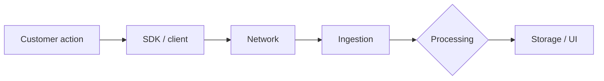

# Support Triage Report

**Ticket:** [ticket ID or short summary]
**Customer:** [org / user / unknown]
**Issue Type:** [Bug / How-to / Feature request / Account / Integration / Data / Performance / Other]
**Product Area:** [smallest meaningful area]
**Priority:** [🔴 P1 / 🟠 P2 / 🟡 P3 / 🟢 P4]
**Plan Tier (if known):** [tier]
**SLA Target (if applicable):** [response window]
**Environment:** [browser / SDK / API / backend / mobile / unknown]
**Investigation Mode:** read-only

---

## 📖 Context for Reviewers

> **What the customer is trying to do:** [1–2 sentences in plain English, no jargon.]
>
> **Which feature is involved:** [Name + link to docs page + one-sentence description.]
>
> **What's going wrong (in plain English):** [The problem without technical detail.]
>
> **Customer's stack:** [Key technologies a reviewer will need to know.]

## Issue Summary

[Rewrite the customer's issue clearly in 2–4 sentences.]

## Intake

| Field | Value |
|---|---|
| Timeframe | [when it started, ongoing? observed range] |
| Impact | [who or what is affected, blast radius] |
| Identifiers | [redacted or safe identifiers only] |
| Reproduction | [steps, expected vs actual, frequency, or "not provided"] |
| Missing Context | [smallest next pieces of information needed] |

## Evidence Gathered

| # | Source / Query | Finding | Status |
|---|---|---|---|
| 1 | [tool, docs URL, log query, issue search] | [finding] | ✅ Verified / ⚠️ Inferred / ❌ Unverified / 🔍 Searched, no match |
| 2 | [source] | [finding] | ✅ / ⚠️ / ❌ / 🔍 |

This is the single source of truth for the report. Every claim below references row numbers from this table.

## 🐛 Known-Issue Search

| # | Query type | Repo / tracker | Query | Best Candidate | Conclusion |
|---|---|---|---|---|---|
| 1 | Hybrid | [repo] | [query] | [issue/release/doc] | match / rejected / no match |
| 2 | Lexical | [repo] | [query] | [issue/release/doc] | match / rejected / no match |
| 3 | Exact | [repo] | [query] | [issue/release/doc] | match / rejected / no match |
| 4 | Recent | [repo] | [query] | [issue/release/doc] | match / rejected / no match |

**Closest rejected candidates:** [list with one-line rejection reasons]
**Search gaps:** [if any]

If "no match" is asserted, all four query types must appear above. See the agent's Known-Issue Search Gate for why.

## 🗺️ How It Works (and Where It Breaks)

Include a small Mermaid diagram for any issue that involves data flow, timing, config chains, or multi-step processes. Skip for trivial issues (e.g. typo in a config key). Mark the broken step.

## 🎯 Root-Cause Assessment

**Assessment:** [best current explanation, plain English]

**Confidence:** [Confirmed by data | Likely based on pattern match | Suspected, needs human verification]

**Reasoning:** [What evidence rows support the assessment, what remains uncertain, and which caps apply (root-cause unverified → Medium; known-issue search incomplete → Low; etc.).]

**Not explained:** [Symptoms or facts this hypothesis does not account for. Write "Nothing known" only after checking.]

## Recommended Next Action

1. [Action — be specific. Use 🔧 for workaround, 📝 for docs fix, 🚨 for escalation trigger.]
2. [Action]
3. [Action]

## Escalation Decision

**Decision:** [No escalation needed | Escalate to engineering]

**Reason:** [Why]
**Suggested owner if escalated:** [team / component / unknown]
**Follow-up cadence:** [when to check back]

If escalating, attach an Escalation Brief generated from the `escalation` skill's `references/escalation-brief-template.md`.

## 🔎 Verify This Report

A short checklist a reviewer can follow without deep product knowledge. Each step should be a clickable link, a copy-pasteable command, or a specific thing to look for.

1. [ ] **[Claim being verified]**
   - [Exact action: open this link / run this command]
   - [What you should see if the claim is correct]

2. [ ] **[Next claim]**
   - …

Keep to 3–5 steps. Focus on the root-cause and recommended-fix claims.

## 💬 Draft Customer Response

⚠️ **No emojis in this section.** This block is copy-pasteable into the support tool as-is.

[Ready-to-send response. Acknowledge → finding → next action → smallest missing context ask → expectation-setting close. No internal tool names, no private links, no raw queries, no sensitive data.]

--- END OF CUSTOMER-FACING CONTENT ---

## 🔬 Evidence Pack (internal only)

[`✅ Pre-send spot check: all cited references verified.` OR `⛔ SPOT CHECK FAILED: <what was wrong>. CORRECTED: <what changed>.`]

### Engineer TL;DR

[2–4 sentences. What's happening, how sure you are, what needs to happen.]

### Claim-Source Map

| # | Claim | Source (row #) | Status |
|---|---|---|---|
| 1 | [claim] | [row from Evidence Gathered] | ✅ / ⚠️ / ❌ |

### Unknowns

- [unknown]

### Confidence Score

**Overall:** [High / Medium / Low]

- Verified claims: [N]
- Inferred claims: [N]
- Unverified claims: [N]
- Caps applied: [list any caps from agent rules — root-cause unverified → Medium; known-issue search gate incomplete → Low; "no match" without full matrix → Low (40%); plausible candidate not ruled out → Medium (70%)]

### Redaction confirmation

- Redaction pass: [N] replacements made across [files].
